# MentiQ E-Learning Platform - System Flowcharts

## Flowchart 1: System Architecture & Data Flow

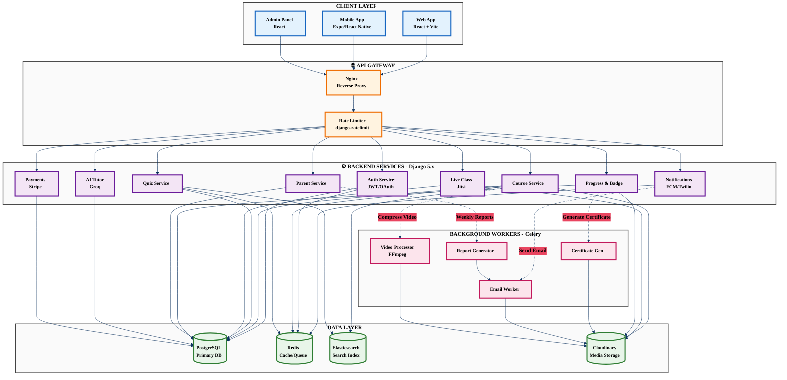

---

## Flowchart 2: User Authentication & Role-Based Access Flow

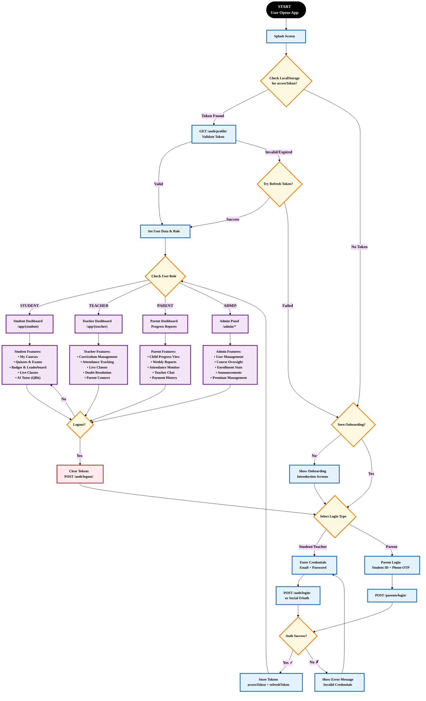

---

## Flowchart 3: Gamification & Badge System Flow

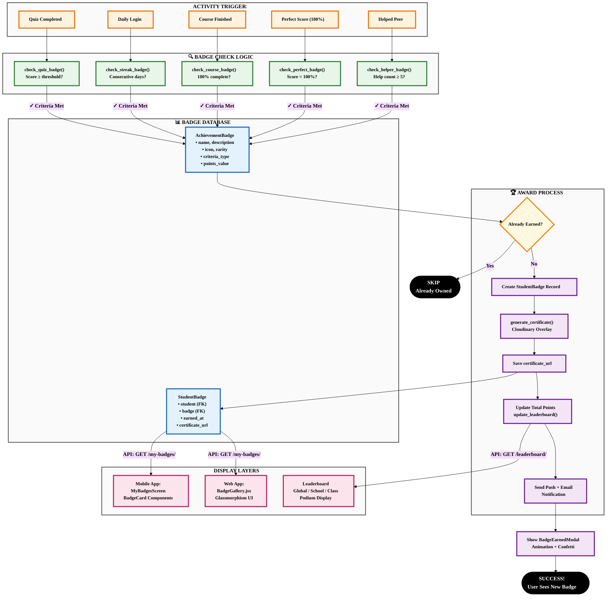

---

## Flowchart 4: Learning Content Delivery Flow

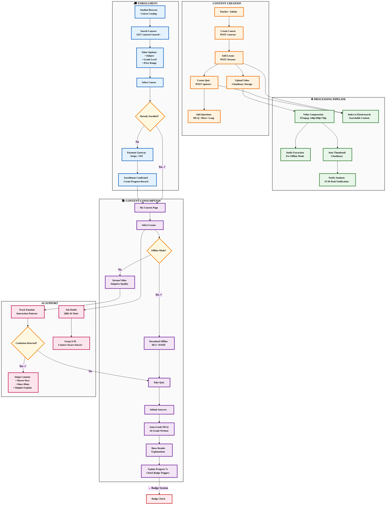

---

## Flowchart 5: Live Class Session Flow

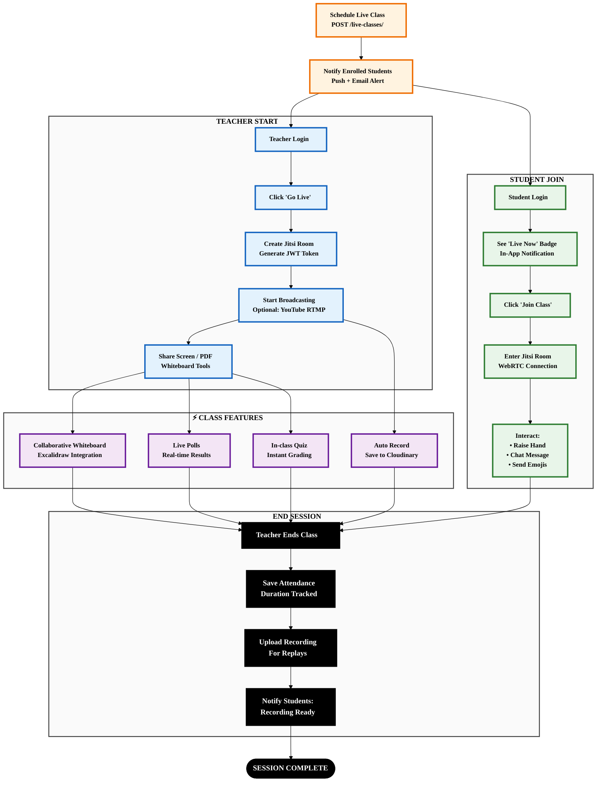

---

## Flowchart 6: Payment & Subscription Flow

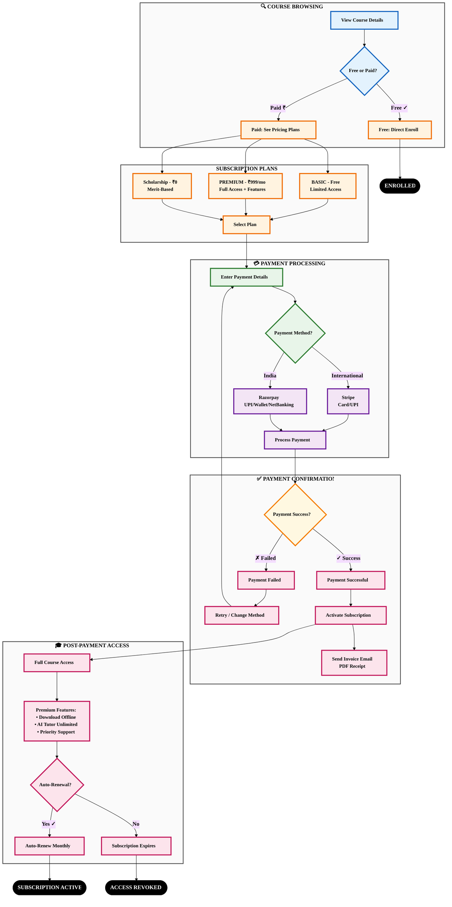

---

## Flowchart 7: Parent Dashboard & Weekly Reporting Flow

```mermaid
%%{init: {'theme': 'base', 'themeVariables': { 'primaryTextColor': '#000000', 'fontSize': '16px', 'fontFamily': 'Arial, sans-serif'}}}%%
flowchart TD
    %% High contrast styles
    classDef linkStyle fill:#e3f2fd,stroke:#1565c0,stroke-width:3px,color:#000000,font-weight:bold,font-size:14px
    classDef viewStyle fill:#fff3e0,stroke:#ef6c00,stroke-width:3px,color:#000000,font-weight:bold,font-size:14px
    classDef reportStyle fill:#e8f5e9,stroke:#2e7d32,stroke-width:3px,color:#000000,font-weight:bold,font-size:14px
    classDef alertStyle fill:#ffebee,stroke:#c62828,stroke-width:3px,color:#000000,font-weight:bold,font-size:14px
    classDef successStyle fill:#e8f5e9,stroke:#2e7d32,stroke-width:3px,color:#000000,font-weight:bold,font-size:14px
    classDef failStyle fill:#ffebee,stroke:#c62828,stroke-width:3px,color:#000000,font-weight:bold,font-size:14px
    classDef decisionStyle fill:#fff8e1,stroke:#f57c00,stroke-width:3px,color:#000000,font-weight:bold,font-size:14px
    classDef endStyle fill:#000000,stroke:#000000,stroke-width:4px,color:#ffffff,font-weight:bold,font-size:16px
    classDef subgraphStyle fill:#fafafa,stroke:#424242,stroke-width:2px,color:#000000,font-weight:bold

    subgraph LINKING["🔗 PARENT-CHILD LINKING"]
        direction TB
        PARENT_REG["<b>Parent Registration</b><br/>Phone + Email"]
        REQUEST_LINK["<b>Request to Link Child</b><br/>Enter Student ID"]
        NOTIFY_STUDENT["<b>Notify Student</b><br/>Approval Request"]
        STUDENT_APPROVE{"<b>Student Approves?</b>"}
        LINKED["<b>✓ Linked Successfully</b>"]
        REJECTED["<b>✗ Link Rejected</b>"]
    end

    subgraph DASHBOARD["📊 PARENT DASHBOARD VIEW"]
        direction TB
        SELECT_CHILD["<b>Select Child</b><br/>If Multiple"]
        VIEW_PROGRESS["<b>View Progress</b><br/>Courses & Completion"]
        VIEW_ATTENDANCE["<b>View Attendance</b><br/>Live Classes & Quizzes"]
        VIEW_GRADES["<b>View Grades</b><br/>Quiz Scores & Trends"]
        VIEW_BADGES["<b>View Badges Earned</b>"]
    end

    subgraph WEEKLY_REPORT["📈 WEEKLY REPORT GENERATION"]
        direction TB
        CELERY_TASK["<b>Celery Scheduled Task</b><br/>Every Sunday 8 AM"]
        AGGREGATE["<b>Aggregate Data:</b><br/>• Study Hours<br/>• Quiz Scores<br/>• Attendance %<br/>• Badges Earned"]
        GEN_PDF["<b>Generate PDF Report</b><br/>Styled Template"]
        SEND_EMAIL["<b>Send Email</b><br/>Weekly Summary"]
        IN_APP_NOTIF["<b>In-App Notification</b><br/>Report Ready"]
    end

    subgraph ALERTS["🚨 SMART ALERTS"]
        direction TB
        LOW_SCORE{"<b>Quiz Score < 40%?</b>"}
        LOW_ATTENDANCE{"<b>Attendance < 75%?</b>"}
        NO_ACTIVITY{"<b>No Login > 3 Days?</b>"}
        ALERT_PARENT["<b>Alert Parent</b><br/>Immediate Email/SMS"]
        SUGGEST_ACTION["<b>Suggest Action:</b><br/>Contact Teacher / Schedule Chat"]
    end

    subgraph ACTIONS["👥 PARENT ACTIONS"]
        direction TB
        CHAT_TEACHER["<b>Chat with Teacher</b>"]
        SCHEDULE_MEETING["<b>Schedule 1:1 Meeting</b>"]
        VIEW_PAYMENTS["<b>View Payment History</b>"]
        SET_GOALS["<b>Set Study Goals</b><br/>For Child"]
    end

    PARENT_REG --> REQUEST_LINK
    REQUEST_LINK --> NOTIFY_STUDENT
    NOTIFY_STUDENT --> STUDENT_APPROVE
    STUDENT_APPROVE -->|"<b>Yes ✓</b>"| LINKED
    STUDENT_APPROVE -->|"<b>No ✗</b>"| REJECTED
    REJECTED --> REQUEST_LINK
    
    LINKED --> SELECT_CHILD
    SELECT_CHILD --> VIEW_PROGRESS
    SELECT_CHILD --> VIEW_ATTENDANCE
    SELECT_CHILD --> VIEW_GRADES
    SELECT_CHILD --> VIEW_BADGES
    
    VIEW_PROGRESS --> CELERY_TASK
    VIEW_ATTENDANCE --> CELERY_TASK
    VIEW_GRADES --> CELERY_TASK
    VIEW_BADGES --> CELERY_TASK
    
    CELERY_TASK --> AGGREGATE
    AGGREGATE --> GEN_PDF
    GEN_PDF --> SEND_EMAIL
    GEN_PDF --> IN_APP_NOTIF
    
    VIEW_GRADES --> LOW_SCORE
    VIEW_ATTENDANCE --> LOW_ATTENDANCE
    VIEW_PROGRESS --> NO_ACTIVITY
    
    LOW_SCORE -->|"<b>Yes</b>"| ALERT_PARENT
    LOW_ATTENDANCE -->|"<b>Yes</b>"| ALERT_PARENT
    NO_ACTIVITY -->|"<b>Yes</b>"| ALERT_PARENT
    
    ALERT_PARENT --> SUGGEST_ACTION
    SUGGEST_ACTION --> CHAT_TEACHER
    SUGGEST_ACTION --> SCHEDULE_MEETING
    
    SEND_EMAIL --> VIEW_PAYMENTS
    IN_APP_NOTIF --> SET_GOALS
    
    CHAT_TEACHER --> END1(["<b>PARENT ENGAGED</b>"])
    SCHEDULE_MEETING --> END1
    VIEW_PAYMENTS --> END1
    SET_GOALS --> END1

    %% Apply styles
    class PARENT_REG,REQUEST_LINK,NOTIFY_STUDENT,STUDENT_APPROVE linkStyle
    class LINKED successStyle
    class REJECTED failStyle
    class SELECT_CHILD,VIEW_PROGRESS,VIEW_ATTENDANCE,VIEW_GRADES,VIEW_BADGES viewStyle
    class CELERY_TASK,AGGREGATE,GEN_PDF,SEND_EMAIL,IN_APP_NOTIF reportStyle
    class LOW_SCORE,LOW_ATTENDANCE,NO_ACTIVITY decisionStyle
    class ALERT_PARENT,SUGGEST_ACTION alertStyle
    class CHAT_TEACHER,SCHEDULE_MEETING,VIEW_PAYMENTS,SET_GOALS alertStyle
    class END1 endStyle
    class LINKING,DASHBOARD,WEEKLY_REPORT,ALERTS,ACTIONS subgraphStyle
```

---

## Flowchart 8: AI Tutor (QBit) Interaction Flow

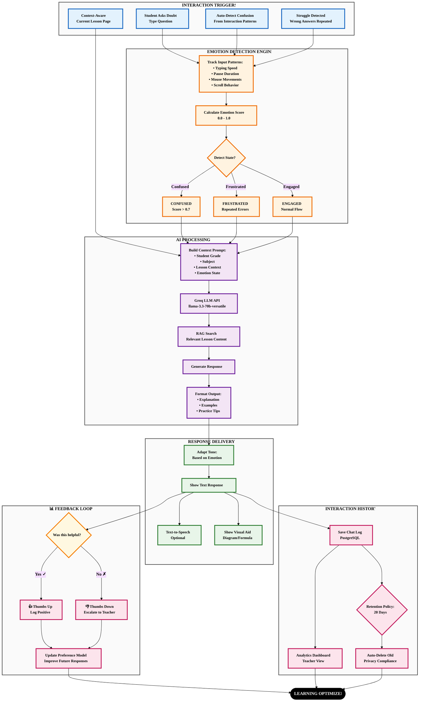

---

# Data Flow Diagrams (DFD)

## Level 0: Context Diagram

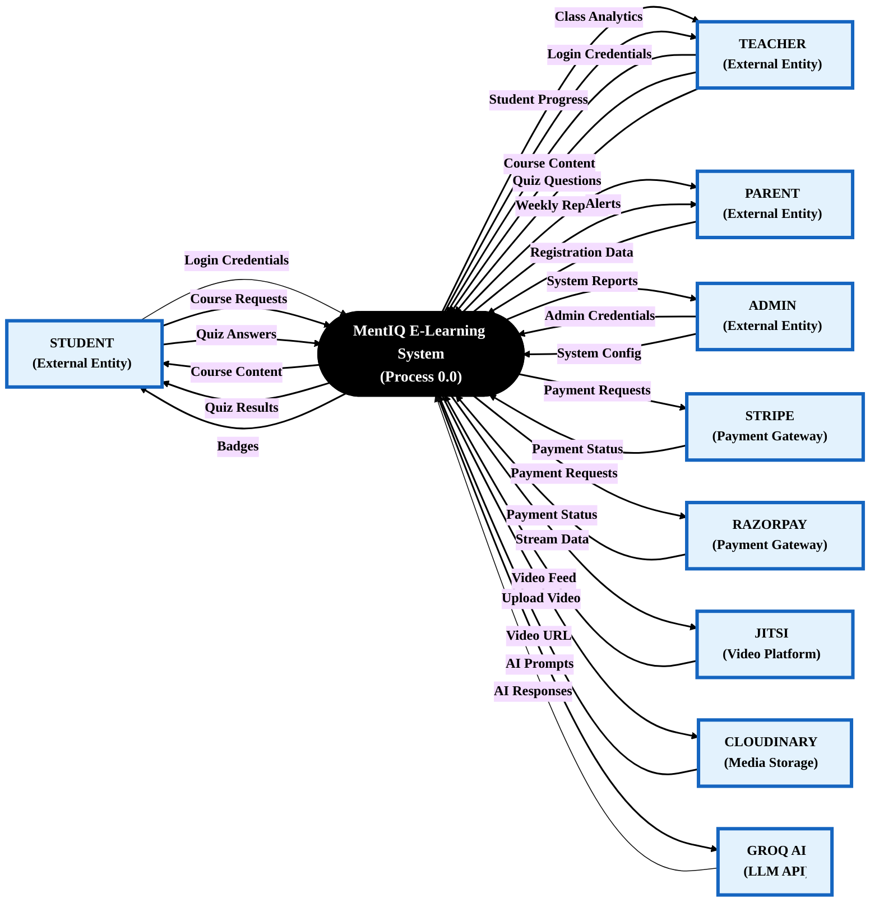

---

## Level 1: Main Processes & Data Stores

```mermaid
%%{init: {'theme': 'base', 'themeVariables': { 'primaryTextColor': '#000000', 'fontSize': '16px', 'fontFamily': 'Arial, sans-serif'}}}%%
flowchart TD
    %% High contrast styles
    classDef processStyle fill:#fff3e0,stroke:#ef6c00,stroke-width:3px,color:#000000,font-weight:bold,font-size:14px
    classDef storeStyle fill:#e8f5e9,stroke:#2e7d32,stroke-width:3px,color:#000000,font-weight:bold,font-size:14px
    classDef entityStyle fill:#e3f2fd,stroke:#1565c0,stroke-width:3px,color:#000000,font-weight:bold,font-size:14px
    classDef externalStyle fill:#f3e5f5,stroke:#6a1b9a,stroke-width:3px,color:#000000,font-weight:bold,font-size:14px

    %% External Entities
    STUDENT["<b>STUDENT</b>"]
    TEACHER["<b>TEACHER</b>"]
    PARENT["<b>PARENT</b>"]
    ADMIN["<b>ADMIN</b>"]

    %% Main Processes
    P1["<b>1.0 AUTHENTICATION</b><br/>Login / Register / Token Mgmt"]
    P2["<b>2.0 COURSE MANAGEMENT</b><br/>CRUD / Enrollment / Progress"]
    P3["<b>3.0 PAYMENT PROCESSING</b><br/>Subscription / Invoice / Renewal"]
    P4["<b>4.0 LIVE CLASSES</b><br/>Schedule / Stream / Recording"]
    P5["<b>5.0 QUIZ & ASSESSMENT</b><br/>Create / Take / Grade"]
    P6["<b>6.0 GAMIFICATION</b><br/>Badges / Leaderboard / Rewards"]
    P7["<b>7.0 AI TUTOR</b><br/>QBit / Emotion Detection"]
    P8["<b>8.0 PARENT DASHBOARD</b><br/>Reports / Alerts / Linking"]
    P9["<b>9.0 CONTENT PROCESSING</b><br/>Video / Compression / Indexing"]

    %% Data Stores
    D1[("D1<br/>USER_DB")]
    D2[("D2<br/>COURSE_DB")]
    D3[("D3<br/>PAYMENT_DB")]
    D4[("D4<br/>QUIZ_DB")]
    D5[("D5<br/>BADGE_DB")]
    D6[("D6<br/>CHAT_HISTORY")]
    D7[("D7<br/>PROGRESS_DB")]
    D8[("D8<br/>REDIS_CACHE")]

    %% External Systems
    STRIPE["<b>STRIPE</b>"]
    RAZORPAY["<b>RAZORPAY</b>"]
    JITSI["<b>JITSI</b>"]
    CLOUDINARY["<b>CLOUDINARY</b>"]
    GROQ["<b>GROQ AI</b>"]

    %% Flows - Authentication
    STUDENT --> P1
    TEACHER --> P1
    PARENT --> P1
    ADMIN --> P1
    P1 <--> D1

    %% Flows - Course Management
    TEACHER --> P2
    STUDENT --> P2
    P2 <--> D2
    P2 <--> D7
    P2 --> CLOUDINARY
    CLOUDINARY --> P2
    P2 --> P9
    P9 --> P2

    %% Flows - Payment
    STUDENT --> P3
    P3 <--> D3
    P3 <--> D1
    P3 --> STRIPE
    STRIPE --> P3
    P3 --> RAZORPAY
    RAZORPAY --> P3

    %% Flows - Live Classes
    TEACHER --> P4
    STUDENT --> P4
    P4 <--> D2
    P4 --> JITSI
    JITSI --> P4
    P4 --> CLOUDINARY

    %% Flows - Quiz
    TEACHER --> P5
    STUDENT --> P5
    P5 <--> D4
    P5 <--> D7

    %% Flows - Gamification
    P7 --> P6
    P5 --> P6
    P2 --> P6
    P4 --> P6
    P6 <--> D5
    P6 <--> D7

    %% Flows - AI Tutor
    STUDENT --> P7
    P7 <--> D6
    P7 <--> D2
    P7 --> GROQ
    GROQ --> P7
    P7 <--> D8

    %% Flows - Parent Dashboard
    PARENT --> P8
    P8 <--> D1
    P8 <--> D7
    P8 <--> D5
    P8 --> D6

    class P1,P2,P3,P4,P5,P6,P7,P8,P9 processStyle
    class D1,D2,D3,D4,D5,D6,D7,D8 storeStyle
    class STUDENT,TEACHER,PARENT,ADMIN entityStyle
    class STRIPE,RAZORPAY,JITSI,CLOUDINARY,GROQ externalStyle
```

---

## Level 2.1: Authentication Process Detail

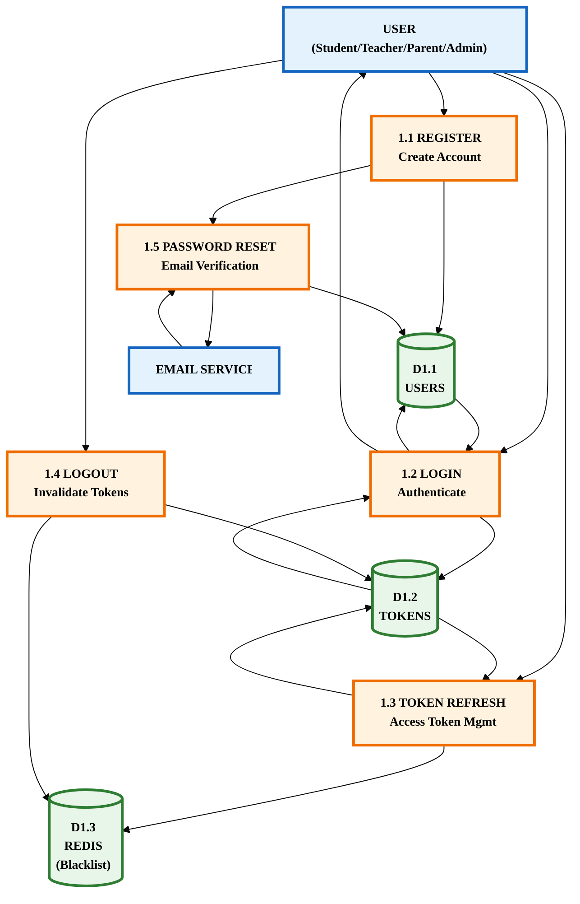

---

## Level 2.2: Course Management Process Detail

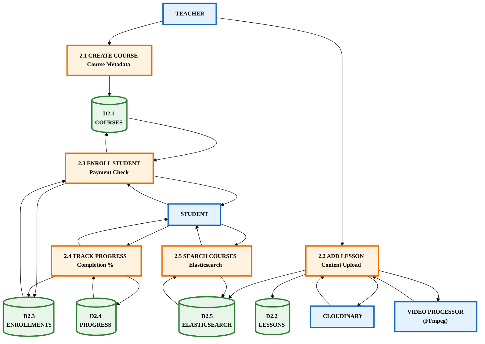

---

## Level 2.3: Payment Processing Process Detail

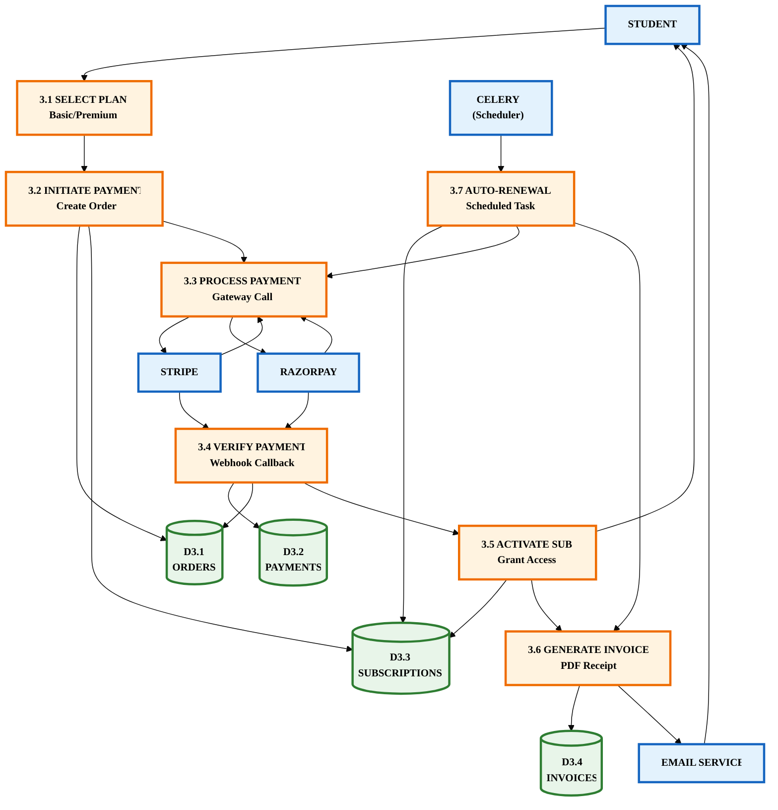

---

## Level 2.4: AI Tutor (QBit) Process Detail

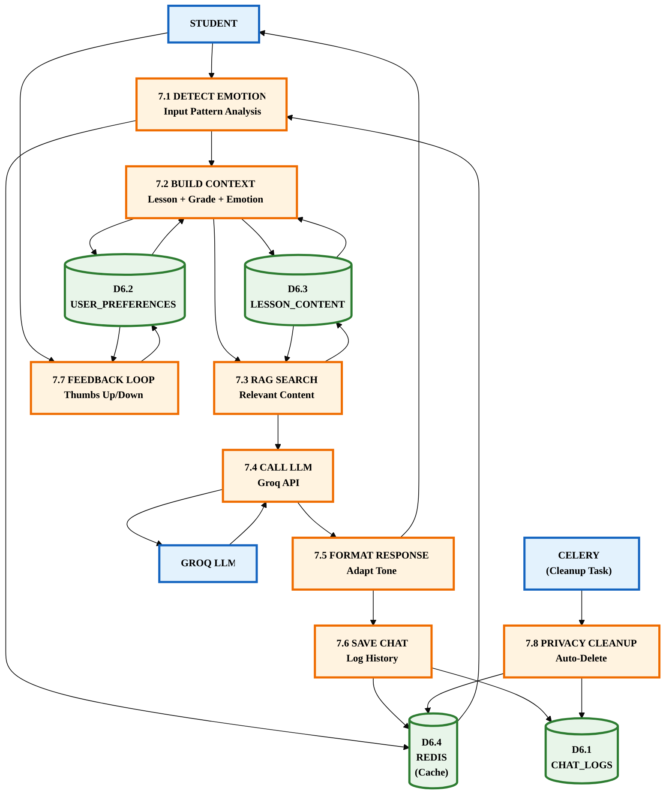

---

## How to Use These Flowcharts

### Option 1: Mermaid Live Editor
1. Visit https://mermaid.live
2. Copy any diagram code between the ```mermaid markers
3. Export as PNG/SVG/PDF

### Option 2: VS Code Extension
Install "Markdown Preview Mermaid Support" extension to preview in VS Code.

### Option 3: Documentation Tools
- **Notion**: Paste mermaid code in code block with "mermaid" language
- **GitHub**: Renders automatically in .md files
- **Draw.io**: Import mermaid syntax

### Option 4: Convert to Images
```bash
# Using mermaid-cli
npm install -g @mermaid-js/mermaid-cli
mmdc -i FLOWCHARTS.md -o flowchart.png
```

---

## Key for Symbols

| Symbol | Meaning |
|--------|---------|
| 🔵 Circle | Start/End Point |
| 🔷 Diamond | Decision Point |
| 🟦 Rectangle | Process/Action |
| 🟩 Cylinder | Database/Storage |
| 🟨 Document | Document/File |
| ➡️ Arrow | Flow Direction |
| -.- Dotted | Background/Async Process |

---

*Generated for MentiQ Capstone Project Report*
*Date: April 22, 2026*
