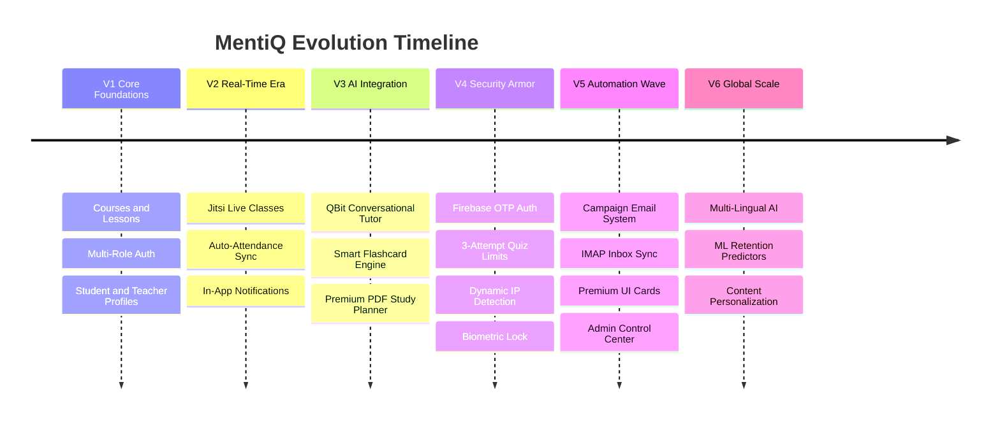

```mermaid
graph TD
    classDef client fill:#0EA5E9,stroke:#0284C7,stroke-width:2px,color:#fff
    classDef gateway fill:#6366F1,stroke:#4F46E5,stroke-width:2px,color:#fff
    classDef core fill:#059669,stroke:#047857,stroke-width:2px,color:#fff
    classDef data fill:#7C3AED,stroke:#6D28D9,stroke-width:2px,color:#fff
    classDef cloud fill:#F59E0B,stroke:#D97706,stroke-width:2px,color:#fff
    classDef async fill:#EC4899,stroke:#DB2777,stroke-width:2px,color:#fff

    subgraph CLIENTS["Presentation Layer"]
        M["Expo Mobile App"]:::client
        W["Vite Web Portal"]:::client
    end

    subgraph AUTH["Security Gateway"]
        API["DRF API Gateway"]:::gateway
        FB["Firebase OTP"]:::gateway
    end

    subgraph CORE["Django Core - 21 Domain Apps"]
        U["Users and Auth"]:::core
        C["Courses and Lessons"]:::core
        Q["Quizzes and Assessment"]:::core
        L["Live Classes and Video"]:::core
        AI["AI Tutor and Intelligence"]:::core
        A["Attendance and Progress"]:::core
        N["Notifications and Email"]:::core
        P["Payments and Analytics"]:::core
        AD["Admin Panel"]:::core
    end

    subgraph ASYNC_LAYER["Background Processing"]
        CW["Celery Workers"]:::async
        CB["Celery Beat"]:::async
        FL["Flower Monitor"]:::async
    end

    subgraph DATA["Persistence Layer"]
        PG[("PostgreSQL")]:::data
        RD[("Redis")]:::data
        ES[("Elasticsearch")]:::data
    end

    subgraph CLOUD["Cloud Integrations"]
        GR["Groq Llama 3"]:::cloud
        JT["Jitsi Meet"]:::cloud
        CL["Cloudinary CDN"]:::cloud
        ST["Stripe Payments"]:::cloud
        GM["Gmail SMTP IMAP"]:::cloud
        SN["Sentry Monitoring"]:::cloud
    end

    M --> API
    W --> API
    API <--> FB

    API --> U
    API --> C
    API --> Q
    API --> L
    API --> AI
    API --> A
    API --> N
    API --> P
    API --> AD

    U --> PG
    C --> PG
    Q --> PG
    L --> PG
    AI --> PG
    A --> PG
    N --> PG
    P --> PG

    CW --> RD
    CB --> CW
    FL --> CW
    N --> CW

    AI --> GR
    L --> JT
    C --> CL
    P --> ST
    N --> GM
    AD --> SN
    Q --> ES
```

<![CDATA[<!-- ANIMATED WAVE BANNER -->
<p align="center">
  
</p>

<!-- LOGO -->
<p align="center">
  
</p>

<!-- TYPING SVG -->
<p align="center">
  <a href="#">
    
  </a>
</p>

<p align="center">
  <em>Bridging the digital divide in modern education — powered by AI, driven by innovation.</em>
</p>

<!-- DIVIDER -->
<p align="center">
  
</p>

<!-- CORE TECH BADGES ROW 1 -->
<p align="center">
  
  
  
  
  
  
  
</p>

<!-- CORE TECH BADGES ROW 2 -->
<p align="center">
  
  
  
  
  
  
  
</p>

<!-- CORE TECH BADGES ROW 3 -->
<p align="center">
  
  
  
  
  
  
</p>

<!-- STATUS BADGES -->
<p align="center">
  
  
  
  
  
  
</p>

<!-- DIVIDER -->
<p align="center">
  
</p>

---

##  &nbsp;Table of Contents

| # | Section | Description |
|:---:|:---|:---|
| 01 | [🌟 Vision & Overview](#-vision--overview) | What is MentiQ and why it exists |
| 02 | [🚀 Epic Feature Matrix](#-epic-feature-matrix) | All modules and capabilities |
| 03 | [📱 Screen Inventory](#-screen-inventory) | Every screen across 3 platforms |
| 04 | [🏗️ Architecture](#-technical-architecture) | System design and data flow |
| 05 | [📡 API Routes](#-api-command-center) | All 17 API route groups |
| 06 | [📂 Codebase Anatomy](#-codebase-anatomy) | Folder structure breakdown |
| 07 | [🔮 Environment Config](#-environment--secrets-config) | Environment variables guide |
| 08 | [⚡ Launch Sequence](#-launch-sequence) | Step-by-step deployment |
| 09 | [🎯 QA Runbook](#-verification--qa-runbook) | Testing and verification |
| 10 | [🗺️ Roadmap](#-evolutionary-roadmap) | Milestones and progress |
| 11 | [📜 License](#-license) | MIT License |

---

## 🌟 Vision & Overview

**MentiQ** is a groundbreaking, full-stack e-learning ecosystem that transcends traditional LMS platforms. Built with a **Tri-Platform Architecture** — native mobile (iOS + Android via Expo), modern web (Vite + React), and an enterprise-grade Django backend — MentiQ delivers a seamlessly synchronized experience powered by **Generative AI**.

### 💡 Why MentiQ?

- 🤖 **AI-First Design** — Groq-powered Llama 3 provides real-time tutoring, flashcard generation, and adaptive study plans
- 🔐 **Zero-Friction Auth** — Firebase OTP + JWT + Multi-ID login (Email / Student ID / Teacher ID)
- 📹 **Production-Grade Video** — Jitsi Meet integration for unlimited live sessions
- ⚡ **Real-Time Sync** — Attendance, notifications, and progress update instantly across devices
- 📊 **Enterprise Analytics** — Celery-powered background analytics with Elasticsearch indexing

> *"To democratize intelligence-driven education by making classroom management effortless, learning deeply personalized, and assessments unequivocally fair."*

---

## 🚀 Epic Feature Matrix

<!-- DIVIDER -->
<p align="center">
  
</p>

### 🤖 QBit AI Intelligence Center

| Feature | Description | Tech |
|:---|:---|:---|
| 💬 **Real-Time AI Tutor** | Context-aware conversational assistant with markdown rendering | `Groq API` · `Llama 3` |
| 🃏 **Smart Flashcards** | Auto-generates spaced-repetition decks from lesson content | `NLP` · `Semantic Extraction` |
| 📅 **Premium Study Planner** | Generates weekly schedules with DataList subject picker → exports as styled PDFs | `expo-print` · `Custom Engine` |
| 📊 **Knowledge Graph** | Tracks `quiz_accuracy`, `time_spent`, `flashcard_performance` per course | `Recharts` · `D3` |
| 🧠 **Intelligence Module** | Dedicated AI center screen with a 70K-character index file | `TypeScript` · `React Native` |

### 🔐 Advanced Security & Authentication

| Feature | Description | Tech |
|:---|:---|:---|
| 📱 **Firebase OTP** | Passwordless phone verification via Firebase Phone Auth SDK | `firebase-admin` · `expo-firebase` |
| 🔑 **Multi-Mode Login** | Authenticate via Email, Student ID, or Teacher ID seamlessly | `Custom Backend Logic` |
| 🛡️ **JWT Rotation** | Stateless sessions with SimpleJWT, auto-refresh, and token blacklisting | `djangorestframework-simplejwt` |
| 🔒 **Biometric Lock** | Local authentication via fingerprint / face ID on mobile | `expo-local-authentication` |
| 🌐 **Dynamic IP Bypass** | Auto-detects local network IP for frictionless multi-device dev | `Custom Network Fetcher` |
| ⚙️ **Rate Limiting** | Brute-force protection on sensitive endpoints | `django-ratelimit` |
| 🔐 **Argon2 Hashing** | Military-grade password hashing algorithm | `argon2-cffi` |

### 🎥 Virtual Classrooms & Live Sync

| Feature | Description | Tech |
|:---|:---|:---|
| 🎬 **Pro-Grade Video** | Enterprise Jitsi Meet integration for 1:1 and group sessions | `Jitsi SDK` · `WebView` |
| 💬 **Live Chat System** | In-session messaging with dedicated chat store | `Zustand` · `WebSocket` |
| 📍 **Auto-Attendance Sync** | Teacher marks → student dashboard updates instantly | `REST` · `Real-time Polling` |
| 📹 **Video Lectures** | Upload, manage, and stream pre-recorded content | `Cloudinary` · `expo-video` |
| 📅 **Smart Booking** | Role-aware calendar scheduling with conflict detection | `DateTimePicker` |
| 🎯 **Video Streaming Service** | Dedicated streaming infrastructure with adaptive quality | `videoStreamingService.ts` |

### 💯 Assessment & Analytics Engine

| Feature | Description | Tech |
|:---|:---|:---|
| 🧠 **Advanced Quizzes** | MCQ, True/False, Multi-Select with time-boxing | `QuizScreen.tsx` |
| ⚖️ **Anti-Cheat System** | Server-enforced **3-attempt daily limit** per quiz | `Backend Validation` |
| 📊 **Micro-Level Analysis** | Per-question breakdown: submitted vs. correct answer comparison | `QuizAnalysisScreen.tsx` |
| 🏆 **Result Dashboard** | Beautiful grade cards with score percentages and attempt history | `QuizResultScreen.tsx` |
| 📈 **Platform Analytics** | Celery-generated daily snapshots of engagement, revenue, and scores | `django-celery-beat` |
| 🔍 **Elasticsearch Index** | Full-text search across courses, lessons, and users | `elasticsearch-dsl` |

### 📧 Enterprise Communication Engine

| Feature | Description | Tech |
|:---|:---|:---|
| 📩 **Auto Welcome Emails** | Triggered on registration via async Celery workers | `Gmail SMTP` · `Celery` |
| 📣 **Campaign System** | Admin-targeted mass emailing to student cohorts | `Campaign Model` |
| 📥 **IMAP Inbox Sync** | Pulls support emails directly into the admin dashboard | `IMAP` · `Gmail` |
| 🔔 **Push Notifications** | Firebase Cloud Messaging for quiz alerts, class reminders | `fcm-django` · `firebase-admin` |
| 📞 **SMS Integration** | Twilio-powered SMS alerts for critical notifications | `twilio` |
| ✉️ **EmailJS Frontend** | Client-side contact forms with direct email dispatch | `@emailjs/browser` |

### 📚 Course & Content Management

| Feature | Description | Tech |
|:---|:---|:---|
| 🎓 **Course Engine** | Full CRUD with enrollment tracking, pricing, and progress binding | `Django ORM` |
| 📖 **Lesson Builder** | Rich content creation with media attachments | `Cloudinary` · `expo-document-picker` |
| 📢 **Announcements** | Broadcast system with premium card UI and push integration | `Premium UI Cards` |
| 💳 **Stripe Payments** | Secure course purchases and subscription management | `stripe` · `Webhooks` |
| 👨‍🎓 **Student Progress** | Circular SVG progress tracking with milestone gamification | `Custom SVG` |
| 🏫 **Curriculum Manager** | Drag-and-arrange lesson ordering with bulk operations | `CurriculumManagementPage.jsx` |

### 👑 Admin Control Center

| Feature | Description | Tech |
|:---|:---|:---|
| 📊 **Admin Dashboard** | Real-time platform metrics with Recharts visualizations | `recharts` · `lucide-react` |
| 👥 **User Management** | CRUD for students and teachers with detailed profile views | `AdminUserDetail.jsx` |
| 💎 **Premium Plans** | Subscription tier management with custom pricing | `AdminPremium.jsx` |
| 📋 **Enrollment Manager** | Track and manage all course enrollments | `AdminEnrollments.jsx` |
| 🎨 **Premium Profile UI** | 21KB+ of custom CSS for polished admin profiles | `AdminProfile.css` |
| 📣 **Announcement Manager** | Create and broadcast platform-wide announcements | `AdminAnnouncements.jsx` |

---

<!-- DIVIDER -->
<p align="center">
  
</p>

## 📱 Screen Inventory

> **33+ Mobile Screens · 49 Web Components · 14 Admin Files — across 3 platforms**

### 📱 Mobile App — Student Screens

| Screen | File | Purpose |
|:---|:---|:---|
| 🏠 Home | `StudentHomeScreen.tsx` | Dashboard hub |
| 📚 Browse Courses | `BrowseCoursesScreen.tsx` | Course catalog & discovery |
| 🎥 Browse Live Classes | `BrowseLiveClassesScreen.tsx` | Live class finder |
| 📊 Progress | `StudentProgressScreen.tsx` | Visual progress tracker |
| 📝 All Quizzes | `AllQuizzesScreen.tsx` | Quiz library browser |
| 🎬 Video Lectures | `StudentVideoLecturesScreen.tsx` | Video player |
| 📹 Live Classroom | `StudentLiveClassRoomScreen.tsx` | Live room participant |
| 🧠 AI Center | `ai-center/index.tsx` (70KB!) | Full AI intelligence hub |

### � Mobile App — Teacher Screens

| Screen | File | Purpose |
|:---|:---|:---|
| 🏠 Home | `TeacherHomeScreen.tsx` | Teaching hub |
| 📚 My Courses | `MyCoursesScreen.tsx` | Course manager |
| ➕ Create Course | `CreateCourseScreen.tsx` | Course builder |
| 📖 Create Lesson | `CreateLessonScreen.tsx` | Lesson creator |
| 📝 Create Quiz | `CreateQuizScreen.tsx` | Quiz designer |
| 🎥 Create Live Class | `CreateLiveClassScreen.tsx` | Class scheduler |
| 📢 Create Announcement | `CreateAnnouncementScreen.tsx` | Broadcaster |
| 📋 Manage Lessons | `ManageLessonsScreen.tsx` | Lesson organizer |
| 📋 Manage Quizzes | `ManageQuizzesScreen.tsx` | Quiz manager |
| 📋 Manage Live Classes | `ManageLiveClassesScreen.tsx` | Class admin |
| 📋 Manage Videos | `ManageVideoLecturesScreen.tsx` | Video admin |
| 📹 Live Classroom | `LiveClassRoomScreen.tsx` | Teaching room |
| 👤 Student Detail | `StudentDetailScreen.tsx` | Student profiles |
| 📊 Teacher Progress | `TeacherProgressScreen.tsx` | Analytics view |

### 📱 Mobile App — Shared Screens

| Screen | File | Purpose |
|:---|:---|:---|
| 👤 Profile | `ProfileScreen.tsx` (37KB!) | Rich profile management |
| 🔒 Security | `SecurityScreen.tsx` | Password & OTP settings |
| 📚 Course Detail | `CourseDetailScreen.tsx` | Course deep-dive |
| 📖 Course Lessons | `CourseLessonsScreen.tsx` | Lesson browser |
| 📖 Lesson Detail | `LessonDetailScreen.tsx` | Content viewer |
| 📝 Quiz | `QuizScreen.tsx` | Quiz engine |
| 🏆 Quiz Result | `QuizResultScreen.tsx` | Result analysis |
| 📊 Quiz Analysis | `QuizAnalysisScreen.tsx` | Per-question breakdown |
| 📢 Announcements | `AnnouncementsScreen.tsx` | News feed |
| ⚙️ Notification Settings | `NotificationSettingsScreen.tsx` | Alert config |
| 📞 Contact Us | `ContactUsScreen.tsx` | Support form |
| ℹ️ About | `AboutScreen.tsx` | Platform info |

### 💻 Web Dashboard — Components

| Component | File | Purpose |
|:---|:---|:---|
| � Greeting Card | `GreetingCard.jsx` | Personalized welcome |
| 📊 Progress Card | `ProgressCard.jsx` | SVG progress rings |
| 📈 Stats Card | `StatsCard.jsx` | Key metrics display |
| 📖 Last Lesson Card | `LastLessonCard.jsx` | Resume learning |
| 📍 Attendance Card | `AttendanceCard.jsx` | Attendance metrics |
| 📅 Calendar Card | `CalendarCard.jsx` | Interactive calendar |
| 🧠 Knowledge Graph | `KnowledgeGraphCard.jsx` | Mastery map |
| 🤖 AI Assistant | `AIAssistantCard.jsx` | QBit web client |
| 🎥 Classroom Page | `ClassroomPage.jsx` | Virtual room |
| 📚 My Courses Page | `MyCoursesPage.jsx` | Course gallery |
| 👤 Profile Page | `ProfilePage.jsx` | Rich profiles |
| ❓ Doubts Page | `DoubtsPage.jsx` | Q&A system |
| 🔔 Notifications | `NotificationsPage.jsx` | Alert center |
| 📞 Contact Us | `ContactUsPage.jsx` | Support portal |
| 📋 Curriculum Mgmt | `CurriculumManagementPage.jsx` | Course organizer |

### 👑 Admin Suite — 14 Files

| Component | File | Purpose |
|:---|:---|:---|
| 📊 Dashboard | `AdminDashboard.jsx` | Platform metrics |
| 👤 Profile | `AdminProfile.jsx` | Admin profile view |
| 🎓 Students | `AdminStudents.jsx` | Student management |
| 👨‍🏫 Teachers | `AdminTeachers.jsx` | Teacher management |
| 📚 Courses | `AdminCourses.jsx` | Course management |
| 🎫 Enrollments | `AdminEnrollments.jsx` | Enrollment tracking |
| 📢 Announcements | `AdminAnnouncements.jsx` | Broadcast manager |
| 💎 Premium | `AdminPremium.jsx` | Subscription plans |
| 👥 User Detail | `AdminUserDetail.jsx` | Deep user profiles |

---

<!-- DIVIDER -->
<p align="center">
  
</p>

## 🏗️ Technical Architecture

<p align="center">
  
</p>



---

<!-- DIVIDER -->
<p align="center">
  
</p>

## 📡 API Command Center

> **17 Versioned Route Groups + Health Check + Swagger Docs**

| # | Endpoint Prefix | Module | Key Operations |
|:---:|:---|:---|:---|
| 01 | `/api/v1/auth/` | 🔐 Authentication | Register, Login, JWT Refresh, Logout, Password Reset |
| 02 | `/api/v1/students/` | 🎓 Students | Profile CRUD, Dashboard Data, Enrollment Stats |
| 03 | `/api/v1/teachers/` | 👨‍🏫 Teachers | Profile CRUD, Course Stats, Student Management |
| 04 | `/api/v1/courses/` | 📚 Courses | Full CRUD, Search, Filter, Enrollment Triggers |
| 05 | `/api/v1/lessons/` | 📖 Lessons | Create, Order, Media Upload, Content Management |
| 06 | `/api/v1/quizzes/` | 📝 Quizzes | CRUD, Submit and Grade, Attempt History, Analysis |
| 07 | `/api/v1/enrollments/` | 🎫 Enrollments | Enroll, Unenroll, Active Tracking, Stats |
| 08 | `/api/v1/progress/` | 📊 Progress | Lesson Progress, Course Completion, Milestones |
| 09 | `/api/v1/live-classes/` | 🎥 Live Classes | Create Room, Join, Schedule, Recordings |
| 10 | `/api/v1/announcements/` | 📢 Announcements | Broadcast, Target, Archive, Analytics |
| 11 | `/api/v1/notifications/` | 🔔 Notifications | Push, In-App, Settings, Batch Operations |
| 12 | `/api/v1/payments/` | 💳 Payments | Stripe Checkout, Webhooks, Revenue Tracking |
| 13 | `/api/v1/analytics/` | 📈 Analytics | Daily Snapshots, Course Insights, User Metrics |
| 14 | `/api/v1/media/` | 🖼️ Media | Upload, Transform, CDN URLs, Gallery |
| 15 | `/api/v1/ai/` | 🤖 AI Tutor | Chat, Flashcards, Study Plans, Knowledge Graph |
| 16 | `/api/v1/emails/` | 📧 Emails | Campaigns, IMAP Sync, Contact Form, Logs |
| 17 | `/api/v1/attendance/` | 📍 Attendance | Mark, History, Reports, Session Tracking |
| — | `/api/v1/admin/` | 👑 Admin Panel | Platform Management, User Control, Analytics |
| — | `/api/health/` | ❤️ Health Check | System status verification |
| — | `/api/docs/` | 📜 Swagger UI | Auto-generated API documentation |
| — | `/api/redoc/` | 📘 ReDoc | Alternative API documentation |

---

<!-- DIVIDER -->
<p align="center">
  
</p>

## 📂 Codebase Anatomy

```text
📦 MentiQ Capstone Project
│
├── 🐍 backend/                              Django 5.x REST API Server
│   ├── config/                              Core Configuration
│   │   ├── settings.py                      12KB master settings
│   │   ├── urls.py                          17 API route groups
│   │   ├── celery.py                        Async task orchestration
│   │   ├── asgi.py / wsgi.py                Server adapters
│   │   └── __init__.py                      Celery app loader
│   │
│   ├── apps/                                21 Domain Microservices
│   │   ├── users/           (14 files)      Auth, JWT, Registration
│   │   ├── students/        (7 files)       Student profiles and data
│   │   ├── teachers/        (7 files)       Teacher profiles and data
│   │   ├── courses/         (11 files)      Course CRUD and catalog
│   │   ├── lessons/         (9 files)       Lesson management
│   │   ├── quizzes/         (12 files)      Quiz engine and grading
│   │   ├── enrollments/     (9 files)       Enrollment tracking
│   │   ├── progress/        (9 files)       Progress computation
│   │   ├── live_classes/    (13 files)      Jitsi room management
│   │   ├── attendance/      (10 files)      Attendance sync engine
│   │   ├── announcements/   (10 files)      Broadcast system
│   │   ├── notifications/   (13 files)      FCM + in-app alerts
│   │   ├── payments/        (9 files)       Stripe integration
│   │   ├── analytics/       (11 files)      Celery snapshots
│   │   ├── ai_tutor/        (9 files)       QBit AI engine
│   │   ├── intelligence/    (9 files)       Advanced AI logic
│   │   ├── emails/          (12 files)      SMTP + IMAP + Campaigns
│   │   ├── media/                           Upload handling
│   │   ├── admin_panel/     (10 files)      Admin endpoints
│   │   └── core/            (8 files)       Shared utils and health
│   │
│   ├── requirements.txt                     105 lines / 40+ packages
│   ├── .env / .env.example                  Environment configuration
│   └── manage.py                            Django CLI gateway
│
├── 📱 frontend/                             React Native Expo (v54)
│   ├── app/
│   │   ├── screens/
│   │   │   ├── student/     (8 screens)     Student experiences
│   │   │   ├── teacher/     (14 screens)    Teacher workflows
│   │   │   ├── shared/      (12 screens)    Universal screens
│   │   │   └── Intelligence/                AI sub-navigation
│   │   ├── navigation/                      Navigator config
│   │   └── MainApp.tsx      (13KB)          App orchestrator
│   │
│   ├── components/          (18 files)      Reusable UI Components
│   │   ├── ai/                              QBit Chat + Flashcards
│   │   ├── StudentDashboard.tsx  (26KB)     Rich student dashboard
│   │   └── TeacherDashboard.tsx  (17KB)     Rich teacher dashboard
│   │
│   ├── store/               (9 stores)      Zustand Global State
│   │   ├── authStore / courseStore           Core data stores
│   │   ├── quizStore / progressStore        Learning stores
│   │   ├── liveClassStore / chatStore       Communication stores
│   │   ├── announcementStore / notifStore   Alert stores
│   │   └── videoStreamStore                 Media streaming
│   │
│   ├── services/            (6 services)    External Integrations
│   │   ├── api.ts           (22KB)          Master API client
│   │   ├── firebase.ts                      Firebase SDK init
│   │   ├── ai.service.ts                    AI endpoint client
│   │   ├── emailService.ts                  EmailJS integration
│   │   ├── mediaUpload.ts                   Cloudinary uploads
│   │   └── videoStreamingService.ts         Video infrastructure
│   │
│   └── package.json                         50+ dependencies
│
├── 💻 frontendweb/                          Vite + React 19 Web Portal
│   ├── src/
│   │   ├── components/      (49 files)      Full component library
│   │   ├── admin/           (14 files)      Complete admin panel
│   │   ├── App.jsx          (15KB)          App shell and routing
│   │   ├── api.js                           Axios API client
│   │   └── App.css / index.css              Global styling
│   │
│   └── public/                              Static assets (Logo)
│
├── 📜 LICENSE                               MIT License
└── 📘 README.md                             This documentation
```

---

<!-- DIVIDER -->
<p align="center">
  
</p>

## 🔮 Environment & Secrets Config

| Domain | Keys Required | Responsibility |
|:---|:---|:---|
| 🔐 **Core Identity** | `SECRET_KEY` · `DEBUG` · `ALLOWED_HOSTS` | Cryptographic signing, error modes, gateway whitelists |
| 🛢️ **Database** | `DATABASE_URL` | PostgreSQL connection string for Django ORM |
| ⚡ **Cache Layer** | `CELERY_BROKER_URL` · `CELERY_RESULT_BACKEND` | Redis-backed async task queue and result storage |
| 🧠 **AI Engine** | `GROQ_API_KEY` | Authenticates Llama 3 calls for QBit tutor and planner |
| 📧 **Mail System** | `EMAIL_HOST_USER` · `EMAIL_HOST_PASSWORD` · `IMAP_USER` | Gmail SMTP outbound + IMAP inbound sync |
| ✉️ **Frontend Mail** | `EMAILJS_SERVICE_ID` · `EMAILJS_TEMPLATE_ID` · `EMAILJS_PUBLIC_KEY` | Client-side contact form dispatch |
| 💳 **Payments** | `STRIPE_SECRET_KEY` · `STRIPE_WEBHOOK_SECRET` | Secure checkout and subscription webhooks |
| 🔥 **Firebase** | `google-services.json` · Firebase Admin SDK JSON | Phone OTP auth + FCM push notifications |
| ☁️ **Media CDN** | `CLOUDINARY_CLOUD_NAME` · `CLOUDINARY_API_KEY` · `CLOUDINARY_API_SECRET` | Image and video upload and transformation |
| 📊 **Monitoring** | `SENTRY_DSN` | Error tracking and performance monitoring |
| 🔍 **Search** | `ELASTICSEARCH_URL` | Full-text search indexing configuration |

---

<!-- DIVIDER -->
<p align="center">
  
</p>

## ⚡ Launch Sequence

### 1️⃣ Backend Server

```bash
# Enter the backend directory
cd backend

# Create isolated Python environment
python -m venv .venv
source .venv/bin/activate          # Windows: .venv\Scripts\activate

# Install all 40+ dependencies
pip install -r requirements.txt

# Configure environment
cp .env.example .env               # Edit .env with your credentials

# Migrate database schemas
python manage.py migrate

# Launch server (0.0.0.0 enables dynamic IP network access)
python manage.py runserver 0.0.0.0:8000
```

### 2️⃣ Background Workers (Celery + Redis)

```bash
# Ensure Redis is running first
docker run -d -p 6379:6379 redis

# Terminal A: Launch task execution workers
celery -A config worker -l info

# Terminal B: Launch periodic task scheduler
celery -A config beat -l info

# Terminal C: (Optional) Launch Flower monitoring UI
celery -A config flower
# Open http://localhost:5555 for task monitoring dashboard
```

### 3️⃣ Web Dashboard (Vite)

```bash
cd frontendweb
npm install
npm run dev
# Dashboard available at http://localhost:5173
```

### 4️⃣ Mobile App (Expo)

```bash
cd frontend
npm install
npx expo start --clear
# Scan the QR code with Expo Go app on your phone
# Or press 'a' for Android emulator / 'i' for iOS simulator
```

---

<!-- DIVIDER -->
<p align="center">
  
</p>

## 🎯 Verification & QA Runbook

> Execute these verification matrices to certify your local instance:

- [ ] **❤️ Health Pulse** — Verify `GET /api/health/` returns `{"status": "healthy"}`
- [ ] **📜 API Docs** — Access auto-generated Swagger UI at `/api/docs/`
- [ ] **🔐 Multi-Auth Check** — Login via Email, then try Student ID — both must yield valid JWTs
- [ ] **📱 OTP Flow** — Trigger Firebase phone verification from mobile ProfileScreen
- [ ] **📝 Quiz Fair-Play** — Take a quiz 4 times; 4th attempt must be blocked by the server
- [ ] **📊 Quiz Analysis** — After submission, verify per-question correct/incorrect breakdown renders
- [ ] **📍 Attendance Sync** — Teacher marks attendance on web → Student mobile dashboard updates instantly
- [ ] **🤖 AI Test** — Send `POST /api/v1/ai/ask/` and verify Groq Llama 3 response
- [ ] **📅 Study Plan** — Generate a plan via DataList input → export as Premium PDF
- [ ] **📧 IMAP Sync** — Send email to support address → verify it appears in admin dashboard
- [ ] **🔔 Push Test** — Create a quiz → verify enrolled students receive Firebase push notification
- [ ] **💳 Payment Flow** — Initiate Stripe checkout → verify webhook confirmation

---

<!-- DIVIDER -->
<p align="center">
  
</p>

## 🗺️ Evolutionary Roadmap

<p align="center">
  
</p>



| Era | Status | Monumental Deliverables |
|:---|:---:|:---|
| **V1: Core Foundations** | ✅ Forged | Courses, Interactive Lessons, Multi-Role Unified Auth |
| **V2: Real-Time Epoch** | ✅ Forged | Live Classes, Jitsi Video Grid, Auto-Attendance Sync |
| **V3: Artificial Mind** | ✅ Forged | QBit Chat, Spaced Flashcards, Premium Plan Generator |
| **V4: Security Armor** | ✅ Forged | Firebase OTP, 3-Attempt Limits, Dynamic IP, Biometrics |
| **V5: Automation Wave** | 🟡 Active | Campaign Emails, IMAP Sync, Premium UI, Admin Suite |
| **V6: Global Scale** | ⚪ Planned | Multi-Lingual AI, ML Retention Predictors |

---

## 📜 License

This project is officially licensed under the **[MIT License](LICENSE)**.

```
MIT License — Copyright (c) 2026 MentiQ
Full terms available in the LICENSE file.
```

---

<!-- FOOTER -->
<p align="center">
  
</p>

<p align="center">
  <a href="mailto:mentiq.learn@gmail.com">
    
  </a>
  &nbsp;
  <a href="http://mentiq.com">
    
  </a>
  &nbsp;
  
</p>

<p align="center">
  <strong>The MentiQ Advanced Systems Team</strong><br/>
  <em>Code written with undeniable passion and purpose.</em>
</p>

<p align="center">
  
</p>

<!-- WAVE FOOTER -->
<p align="center">
  
</p>
]]>
