```mermaid
graph TD
    classDef client fill:#0EA5E9,stroke:#0284C7,stroke-width:2px,color:#fff
    classDef gateway fill:#6366F1,stroke:#4F46E5,stroke-width:2px,color:#fff
    classDef core fill:#059669,stroke:#047857,stroke-width:2px,color:#fff
    classDef data fill:#7C3AED,stroke:#6D28D9,stroke-width:2px,color:#fff
    classDef cloud fill:#F59E0B,stroke:#D97706,stroke-width:2px,color:#fff
    classDef async fill:#EC4899,stroke:#DB2777,stroke-width:2px,color:#fff

    subgraph CLIENTS["📱 Presentation Layer"]
        M["📱 Expo Mobile App<br/>(React Native + TS)"]:::client
        W["💻 Vite Web Portal<br/>(React 19 + JS)"]:::client
    end

    subgraph AUTH["🛡️ Security Gateway"]
        API["🔀 DRF API Gateway<br/>JWT + Rate Limiting"]:::gateway
        FB["🔥 Firebase OTP<br/>Phone Verification"]:::gateway
    end

    subgraph CORE["🧠 Django Core — 21 Domain Apps"]
        U["👤 Users & Auth"]:::core
        C["📚 Courses & Lessons"]:::core
        Q["📝 Quizzes & Assessment"]:::core
        L["🎥 Live Classes & Video"]:::core
        AI["🤖 AI Tutor & Intelligence"]:::core
        A["📍 Attendance & Progress"]:::core
        N["🔔 Notifications & Email"]:::core
        P["💳 Payments & Analytics"]:::core
        AD["👑 Admin Panel"]:::core
    end

    subgraph ASYNC["⚡ Background Processing"]
        CW["🔄 Celery Workers"]:::async
        CB["⏰ Celery Beat Scheduler"]:::async
        FL["🌸 Flower Monitor"]:::async
    end

    subgraph DATA["🗄️ Persistence Layer"]
        PG[("🛢️ PostgreSQL<br/>Primary Database")]:::data
        RD[("⚡ Redis<br/>Cache + Broker")]:::data
        ES[("🔍 Elasticsearch<br/>Search Index")]:::data
    end

    subgraph CLOUD["☁️ Cloud Integrations"]
        GR["🤖 Groq Cloud<br/>Llama 3 LLM"]:::cloud
        JT["📹 Jitsi Meet<br/>Video Rooms"]:::cloud
        CL["☁️ Cloudinary<br/>Media CDN"]:::cloud
        ST["💳 Stripe<br/>Payments"]:::cloud
        GM["📧 Gmail<br/>SMTP + IMAP"]:::cloud
        SN["📊 Sentry<br/>Error Tracking"]:::cloud
    end

    M -->|"JWT / OTP"| API
    W -->|"JWT / OTP"| API
    API <-.-> FB

    API ==> U & C & Q & L & AI & A & N & P & AD

    U & C & Q & L & AI & A & N & P --> PG
    CW -.-> RD
    CB -.-> CW
    FL -.-> CW
    N -.-> CW

    AI --> GR
    L --> JT
    C --> CL
    P --> ST
    N --> GM
    AD --> SN
    Q --> ES
```

<![CDATA[<!-- ═══════════════════════════════════════════════════════════════════════════ -->
<!-- 🎓 MENTIQ — THE ULTIMATE AI-POWERED E-LEARNING ECOSYSTEM README         -->
<!-- ═══════════════════════════════════════════════════════════════════════════ -->

<!-- ✦ ANIMATED WAVE BANNER ✦ -->


<!-- ✦ ANIMATED LOGO & TYPING SVG ✦ -->
<p align="center">
  
</p>
<p align="center">
  <a href="#">
    
  </a>
</p>

<p align="center">
  <i>Bridging the digital divide in modern education — powered by AI, driven by innovation.</i>
</p>

<!-- ✦ ANIMATED DIVIDER LINE ✦ -->


<!-- ✦ CORE TECH BADGES ✦ -->
<p align="center">
  
  
  
  
  
  
  
</p>
<p align="center">
  
  
  
  
  
  
  
</p>
<p align="center">
  
  
  
  
  
  
</p>

<!-- ✦ STATUS BADGES ✦ -->
<p align="center">
  
  
  
  
  
  
  
</p>

<!-- ✦ ANIMATED DIVIDER ✦ -->


<!-- ═══════════════════════════════════════════════════════════════════════════ -->
##  &nbsp; Table of Contents
<!-- ═══════════════════════════════════════════════════════════════════════════ -->

<details open>
<summary>🗂️ <b>Quick Navigation</b></summary>
<br/>

| # | Section | Description |
|:---:|:---|:---|
| 01 | [🌟 Vision & Overview](#-vision--overview) | What is MentiQ and why it exists |
| 02 | [🚀 Epic Feature Matrix](#-epic-feature-matrix) | All modules and capabilities |
| 03 | [📱 Screen Inventory](#-screen-inventory--3-platforms) | Every screen across 3 platforms |
| 04 | [🏗️ Architecture Topology](#%EF%B8%8F-technical-architecture-topology) | System design and data flow |
| 05 | [📡 API Command Center](#-api-command-center--17-route-groups) | All 17 API route groups |
| 06 | [📂 Codebase Anatomy](#-codebase-anatomy) | Folder structure breakdown |
| 07 | [🔮 Environment Config](#-environment--secrets-config) | Environment variables guide |
| 08 | [⚡ Launch Sequence](#-launch-sequence) | Step-by-step deployment |
| 09 | [🎯 QA Runbook](#-verification--qa-runbook) | Testing and verification |
| 10 | [🗺️ Roadmap](#%EF%B8%8F-evolutionary-roadmap) | Milestones and progress |
| 11 | [📜 License](#-license) | MIT License |

</details>

<!-- ═══════════════════════════════════════════════════════════════════════════ -->
##  &nbsp; Vision & Overview
<!-- ═══════════════════════════════════════════════════════════════════════════ -->


**MentiQ** is a groundbreaking, full-stack e-learning ecosystem that transcends traditional LMS platforms. Built with a **Tri-Platform Architecture** — native mobile (iOS + Android via Expo), modern web (Vite + React), and an enterprise-grade Django backend — MentiQ delivers a seamlessly synchronized experience powered by **Generative AI**.

### 💡 Why MentiQ?

- 🤖 **AI-First Design** — Groq-powered Llama 3 provides real-time tutoring, flashcard generation, and adaptive study plans
- 🔐 **Zero-Friction Auth** — Firebase OTP + JWT + Multi-ID login (Email / Student ID / Teacher ID)
- 📹 **Production-Grade Video** — Jitsi Meet integration for unlimited live sessions
- ⚡ **Real-Time Sync** — Attendance, notifications, and progress update instantly across devices
- 📊 **Enterprise Analytics** — Celery-powered background analytics with Elasticsearch indexing

> *"To democratize intelligence-driven education by making classroom management effortless, learning deeply personalized, and assessments unequivocally fair."*

<br clear="right"/>

<!-- ═══════════════════════════════════════════════════════════════════════════ -->
##  &nbsp; Epic Feature Matrix
<!-- ═══════════════════════════════════════════════════════════════════════════ -->

<br/>

<!-- AI Intelligence -->
<details open>
<summary>
  
</summary>
<br/>

| Feature | Description | Tech |
|:---|:---|:---|
| 💬 **Real-Time AI Tutor** | Context-aware conversational assistant with markdown rendering | `Groq API` · `Llama 3` |
| 🃏 **Smart Flashcards** | Auto-generates spaced-repetition decks from lesson content | `NLP` · `Semantic Extraction` |
| 📅 **Premium Study Planner** | Generates weekly schedules with DataList subject picker → exports as styled PDFs | `expo-print` · `Custom Engine` |
| 📊 **Knowledge Graph** | Tracks `quiz_accuracy`, `time_spent`, `flashcard_performance` per course | `Recharts` · `D3` |
| 🧠 **Intelligence Module** | Dedicated AI center screen with a 70K-character index file | `TypeScript` · `React Native` |

</details>

<!-- Security & Auth -->
<details>
<summary>
  
</summary>
<br/>

| Feature | Description | Tech |
|:---|:---|:---|
| 📱 **Firebase OTP** | Passwordless phone verification via Firebase Phone Auth SDK | `firebase-admin` · `expo-firebase` |
| 🔑 **Multi-Mode Login** | Authenticate via Email, Student ID, or Teacher ID seamlessly | `Custom Backend Logic` |
| 🛡️ **JWT Rotation** | Stateless sessions with SimpleJWT, auto-refresh, and token blacklisting | `djangorestframework-simplejwt` |
| 🔒 **Biometric Lock** | Local authentication via fingerprint / face ID on mobile | `expo-local-authentication` |
| 🌐 **Dynamic IP Bypass** | Auto-detects local network IP for frictionless multi-device dev | `Custom Network Fetcher` |
| ⚙️ **Rate Limiting** | Brute-force protection on sensitive endpoints | `django-ratelimit` |
| 🔐 **Argon2 Hashing** | Military-grade password hashing algorithm | `argon2-cffi` |

</details>

<!-- Live Classes -->
<details>
<summary>
  
</summary>
<br/>

| Feature | Description | Tech |
|:---|:---|:---|
| 🎬 **Pro-Grade Video** | Enterprise Jitsi Meet integration for 1:1 and group sessions | `Jitsi SDK` · `WebView` |
| 💬 **Live Chat System** | In-session messaging with dedicated chat store | `Zustand` · `WebSocket` |
| 📍 **Auto-Attendance Sync** | Teacher marks → student dashboard updates instantly | `REST` · `Real-time Polling` |
| 📹 **Video Lectures** | Upload, manage, and stream pre-recorded content | `Cloudinary` · `expo-video` |
| 📅 **Smart Booking** | Role-aware calendar scheduling with conflict detection | `DateTimePicker` |
| 🎯 **Video Streaming Service** | Dedicated streaming infrastructure with adaptive quality | `videoStreamingService.ts` |

</details>

<!-- Assessments -->
<details>
<summary>
  
</summary>
<br/>

| Feature | Description | Tech |
|:---|:---|:---|
| 🧠 **Advanced Quizzes** | MCQ, True/False, Multi-Select with time-boxing | `QuizScreen.tsx` |
| ⚖️ **Anti-Cheat System** | Server-enforced **3-attempt daily limit** per quiz | `Backend Validation` |
| 📊 **Micro-Level Analysis** | Per-question breakdown: submitted vs. correct answer comparison | `QuizAnalysisScreen.tsx` |
| 🏆 **Result Dashboard** | Beautiful grade cards with score percentages and attempt history | `QuizResultScreen.tsx` |
| 📈 **Platform Analytics** | Celery-generated daily snapshots of engagement, revenue, and scores | `django-celery-beat` |
| 🔍 **Elasticsearch Index** | Full-text search across courses, lessons, and users | `elasticsearch-dsl` |

</details>

<!-- Communication -->
<details>
<summary>
  
</summary>
<br/>

| Feature | Description | Tech |
|:---|:---|:---|
| 📩 **Auto Welcome Emails** | Triggered on registration via async Celery workers | `Gmail SMTP` · `Celery` |
| 📣 **Campaign System** | Admin-targeted mass emailing to student cohorts | `Campaign Model` |
| 📥 **IMAP Inbox Sync** | Pulls support emails directly into the admin dashboard | `IMAP` · `Gmail` |
| 🔔 **Push Notifications** | Firebase Cloud Messaging for quiz alerts, class reminders | `fcm-django` · `firebase-admin` |
| 📞 **SMS Integration** | Twilio-powered SMS alerts for critical notifications | `twilio` |
| ✉️ **EmailJS Frontend** | Client-side contact forms with direct email dispatch | `@emailjs/browser` |

</details>

<!-- Course Management -->
<details>
<summary>
  
</summary>
<br/>

| Feature | Description | Tech |
|:---|:---|:---|
| 🎓 **Course Engine** | Full CRUD with enrollment tracking, pricing, and progress binding | `Django ORM` |
| 📖 **Lesson Builder** | Rich content creation with media attachments | `Cloudinary` · `expo-document-picker` |
| 📢 **Announcements** | Broadcast system with premium card UI and push integration | `Premium UI Cards` |
| 💳 **Stripe Payments** | Secure course purchases and subscription management | `stripe` · `Webhooks` |
| 👨‍🎓 **Student Progress** | Circular SVG progress tracking with milestone gamification | `Custom SVG` |
| 🏫 **Curriculum Manager** | Drag-and-arrange lesson ordering with bulk operations | `CurriculumManagementPage.jsx` |

</details>

<!-- Admin Panel -->
<details>
<summary>
  
</summary>
<br/>

| Feature | Description | Tech |
|:---|:---|:---|
| 📊 **Admin Dashboard** | Real-time platform metrics with Recharts visualizations | `recharts` · `lucide-react` |
| 👥 **User Management** | CRUD for students and teachers with detailed profile views | `AdminUserDetail.jsx` |
| 💎 **Premium Plans** | Subscription tier management with custom pricing | `AdminPremium.jsx` |
| 📋 **Enrollment Manager** | Track and manage all course enrollments | `AdminEnrollments.jsx` |
| 🎨 **Premium Profile UI** | 21KB+ of custom CSS for polished admin profiles | `AdminProfile.css` |
| 📣 **Announcement Manager** | Create and broadcast platform-wide announcements | `AdminAnnouncements.jsx` |

</details>

<!-- ✦ ANIMATED DIVIDER ✦ -->


<!-- ═══════════════════════════════════════════════════════════════════════════ -->
##  &nbsp; Screen Inventory — 3 Platforms
<!-- ═══════════════════════════════════════════════════════════════════════════ -->

<br/>

<table>
<tr>
<td width="33%" valign="top">

### 📱 Mobile App (Expo)
**33+ Native Screens**

**🎓 Student Screens**
- `StudentHomeScreen` — Dashboard hub
- `BrowseCoursesScreen` — Course catalog
- `BrowseLiveClassesScreen` — Live class finder
- `StudentProgressScreen` — Progress tracker
- `AllQuizzesScreen` — Quiz library
- `StudentVideoLecturesScreen` — Video player
- `StudentLiveClassRoomScreen` — Live room
- `AI Center (Index)` — 70K char AI hub

**👨‍🏫 Teacher Screens**
- `TeacherHomeScreen` — Teaching hub
- `MyCoursesScreen` — Course manager
- `CreateCourseScreen` — Course builder
- `CreateLessonScreen` — Lesson creator
- `CreateQuizScreen` — Quiz designer
- `CreateLiveClassScreen` — Class scheduler
- `CreateAnnouncementScreen` — Broadcaster
- `ManageLessonsScreen` — Lesson organizer
- `ManageQuizzesScreen` — Quiz manager
- `ManageLiveClassesScreen` — Class admin
- `ManageVideoLecturesScreen` — Video admin
- `LiveClassRoomScreen` — Teaching room
- `StudentDetailScreen` — Student profiles
- `TeacherProgressScreen` — Analytics view

</td>
<td width="33%" valign="top">

### 📱 Shared Screens
**12 Universal Screens**

- `ProfileScreen` — Rich profile (37KB!)
- `SecurityScreen` — Password & OTP
- `CourseDetailScreen` — Course deep-dive
- `CourseLessonsScreen` — Lesson browser
- `LessonDetailScreen` — Content viewer
- `QuizScreen` — Quiz engine
- `QuizResultScreen` — Result analysis
- `QuizAnalysisScreen` — Per-Q breakdown
- `AnnouncementsScreen` — News feed
- `NotificationSettingsScreen` — Alert config
- `ContactUsScreen` — Support form
- `AboutScreen` — Platform info

**🔐 Auth Screens**
- `LoginScreen` — Multi-mode login
- `SignupScreen` — Registration flow
- `OnboardingScreen` — First-time UX

**🧩 Components (18)**
- `StudentDashboard` · `TeacherDashboard`
- `QbitChatWindow` · `QbitFloatingButton`
- `FlashcardDeck` · `UsageTracker`

</td>
<td width="33%" valign="top">

### 💻 Web Dashboard (Vite)
**49 Components + Admin Suite**

**📊 Dashboard Cards**
- `GreetingCard` — Personalized welcome
- `ProgressCard` — SVG progress rings
- `StatsCard` — Key metrics display
- `LastLessonCard` — Resume learning
- `AttendanceCard` — Attendance metrics
- `CalendarCard` — Interactive calendar
- `KnowledgeGraphCard` — Mastery map
- `AIAssistantCard` — QBit web client

**📄 Full Pages**
- `ClassroomPage` — Virtual room
- `MyCoursesPage` — Course gallery
- `ProfilePage` — Rich profiles
- `DoubtsPage` — Q&A system
- `NotificationsPage` — Alert center
- `ContactUsPage` — Support portal
- `OnboardingScreen` — First-run wizard
- `CurriculumManagementPage` — Organizer
- `QuizTakingPage` · `QuizResultPage`

**👑 Admin Suite (14 files)**
- `AdminDashboard` · `AdminProfile`
- `AdminStudents` · `AdminTeachers`
- `AdminCourses` · `AdminEnrollments`
- `AdminAnnouncements` · `AdminPremium`
- `AdminUserDetail` · `AdminUsers`

</td>
</tr>
</table>

<!-- ✦ ANIMATED DIVIDER ✦ -->


<!-- ═══════════════════════════════════════════════════════════════════════════ -->
##  &nbsp; Technical Architecture Topology
<!-- ═══════════════════════════════════════════════════════════════════════════ -->

<p align="center">
  
</p>



<!-- ✦ ANIMATED DIVIDER ✦ -->


<!-- ═══════════════════════════════════════════════════════════════════════════ -->
##  &nbsp; API Command Center — 17 Route Groups
<!-- ═══════════════════════════════════════════════════════════════════════════ -->

<br/>

<div align="center">

| # | Endpoint Prefix | Module | Key Operations |
|:---:|:---|:---|:---|
| 01 | `/api/v1/auth/` | 🔐 Authentication | Register, Login, JWT Refresh, Logout, Password Reset |
| 02 | `/api/v1/students/` | 🎓 Students | Profile CRUD, Dashboard Data, Enrollment Stats |
| 03 | `/api/v1/teachers/` | 👨‍🏫 Teachers | Profile CRUD, Course Stats, Student Management |
| 04 | `/api/v1/courses/` | 📚 Courses | Full CRUD, Search, Filter, Enrollment Triggers |
| 05 | `/api/v1/lessons/` | 📖 Lessons | Create, Order, Media Upload, Content Management |
| 06 | `/api/v1/quizzes/` | 📝 Quizzes | CRUD, Submit & Grade, Attempt History, Analysis |
| 07 | `/api/v1/enrollments/` | 🎫 Enrollments | Enroll, Unenroll, Active Tracking, Stats |
| 08 | `/api/v1/progress/` | 📊 Progress | Lesson Progress, Course Completion, Milestones |
| 09 | `/api/v1/live-classes/` | 🎥 Live Classes | Create Room, Join, Schedule, Recordings |
| 10 | `/api/v1/announcements/` | 📢 Announcements | Broadcast, Target, Archive, Analytics |
| 11 | `/api/v1/notifications/` | 🔔 Notifications | Push, In-App, Settings, Batch Operations |
| 12 | `/api/v1/payments/` | 💳 Payments | Stripe Checkout, Webhooks, Revenue Tracking |
| 13 | `/api/v1/analytics/` | 📈 Analytics | Daily Snapshots, Course Insights, User Metrics |
| 14 | `/api/v1/media/` | 🖼️ Media | Upload, Transform, CDN URLs, Gallery |
| 15 | `/api/v1/ai/` | 🤖 AI Tutor | Chat, Flashcards, Study Plans, Knowledge Graph |
| 16 | `/api/v1/emails/` | 📧 Emails | Campaigns, IMAP Sync, Contact Form, Logs |
| 17 | `/api/v1/attendance/` | 📍 Attendance | Mark, History, Reports, Session Tracking |
| — | `/api/v1/admin/` | 👑 Admin Panel | Platform Management, User Control, Analytics |
| — | `/api/health/` | ❤️ Health Check | System status verification |
| — | `/api/docs/` | 📜 Swagger UI | Auto-generated API documentation |
| — | `/api/redoc/` | 📘 ReDoc | Alternative API documentation |

</div>

<!-- ✦ ANIMATED DIVIDER ✦ -->


<!-- ═══════════════════════════════════════════════════════════════════════════ -->
##  &nbsp; Codebase Anatomy
<!-- ═══════════════════════════════════════════════════════════════════════════ -->

```
📦 MentiQ Capstone Project
│
├── 🐍 backend/                              # Django 5.x REST API Server
│   ├── config/                              # Core Configuration
│   │   ├── settings.py                      # 12KB master settings
│   │   ├── urls.py                          # 17 API route groups
│   │   ├── celery.py                        # Async task orchestration
│   │   ├── asgi.py · wsgi.py                # Server adapters
│   │   └── __init__.py                      # Celery app loader
│   │
│   ├── apps/                                # 🧩 21 Domain Microservices
│   │   ├── users/           (14 files)      # 🔐 Auth, JWT, Registration
│   │   ├── students/        (7 files)       # 🎓 Student profiles & data
│   │   ├── teachers/        (7 files)       # 👨‍🏫 Teacher profiles & data
│   │   ├── courses/         (11 files)      # 📚 Course CRUD & catalog
│   │   ├── lessons/         (9 files)       # 📖 Lesson management
│   │   ├── quizzes/         (12 files)      # 📝 Quiz engine & grading
│   │   ├── enrollments/     (9 files)       # 🎫 Enrollment tracking
│   │   ├── progress/        (9 files)       # 📊 Progress computation
│   │   ├── live_classes/    (13 files)      # 🎥 Jitsi room management
│   │   ├── attendance/      (10 files)      # 📍 Attendance sync engine
│   │   ├── announcements/   (10 files)      # 📢 Broadcast system
│   │   ├── notifications/   (13 files)      # 🔔 FCM + in-app alerts
│   │   ├── payments/        (9 files)       # 💳 Stripe integration
│   │   ├── analytics/       (11 files)      # 📈 Celery snapshots
│   │   ├── ai_tutor/        (9 files)       # 🤖 QBit AI engine
│   │   ├── intelligence/    (9 files)       # 🧠 Advanced AI logic
│   │   ├── emails/          (12 files)      # 📧 SMTP + IMAP + Campaigns
│   │   ├── media/           (—)             # 🖼️ Upload handling
│   │   ├── admin_panel/     (10 files)      # 👑 Admin endpoints
│   │   └── core/            (8 files)       # ⚙️ Shared utils & health
│   │
│   ├── requirements.txt                     # 105 lines / 40+ packages
│   ├── .env / .env.example                  # Environment configuration
│   └── manage.py                            # Django CLI gateway
│
├── 📱 frontend/                             # React Native Expo (v54)
│   ├── app/                                 # 📲 Navigation & Routing
│   │   ├── screens/
│   │   │   ├── student/     (8 screens)     # 🎓 Student experiences
│   │   │   ├── teacher/     (14 screens)    # 👨‍🏫 Teacher workflows
│   │   │   ├── shared/      (12 screens)    # 🔗 Universal screens
│   │   │   ├── auth/        (1 screen)      # 🔐 Auth redirect
│   │   │   └── Intelligence/                # 🧠 AI sub-navigation
│   │   ├── (student)/ · (teacher)/ · (tabs)/# 📂 Role-based layouts
│   │   ├── navigation/                      # 🗺️ Navigator config
│   │   └── MainApp.tsx                      # 🚀 App orchestrator (13KB)
│   │
│   ├── components/          (18 files)      # 🧩 Reusable UI Components
│   │   ├── ai/                              # 🤖 QBit Chat + Flashcards
│   │   ├── StudentDashboard.tsx  (26KB)     # 📊 Rich student dashboard
│   │   └── TeacherDashboard.tsx  (17KB)     # 📊 Rich teacher dashboard
│   │
│   ├── store/               (9 stores)      # 🏪 Zustand Global State
│   │   ├── authStore · courseStore           # Core data stores
│   │   ├── quizStore · progressStore        # Learning stores
│   │   ├── liveClassStore · liveClassChatStore
│   │   ├── announcementStore · notificationStore
│   │   └── videoStreamStore                 # Media streaming
│   │
│   ├── services/            (6 services)    # 🔌 External Integrations
│   │   ├── api.ts           (22KB)          # 🌐 Master API client
│   │   ├── firebase.ts                      # 🔥 Firebase SDK init
│   │   ├── ai.service.ts                    # 🤖 AI endpoint client
│   │   ├── emailService.ts                  # 📧 EmailJS integration
│   │   ├── mediaUpload.ts                   # 📤 Cloudinary uploads
│   │   └── videoStreamingService.ts         # 📹 Video infrastructure
│   │
│   └── package.json                         # 50+ dependencies
│
├── 💻 frontendweb/                          # Vite + React 19 Web Portal
│   ├── src/
│   │   ├── components/      (49 files)      # 🧩 Full component library
│   │   │   ├── Dashboard Cards (8)          # 📊 Greeting · Progress · Stats
│   │   │   ├── Full Pages (10+)             # 📄 Classroom · Profile · Quiz
│   │   │   └── Sidebar · Header · Login     # 🎨 Core layout components
│   │   ├── admin/           (14 files)      # 👑 Complete admin panel
│   │   ├── App.jsx          (15KB)          # 🚀 App shell & routing
│   │   ├── api.js                           # 🌐 Axios API client
│   │   └── App.css · index.css              # 🎨 Global styling
│   │
│   └── public/                              # 📁 Static assets (Logo)
│
├── 📜 LICENSE                               # MIT License
└── 📘 README.md                             # This documentation
```

<!-- ✦ ANIMATED DIVIDER ✦ -->


<!-- ═══════════════════════════════════════════════════════════════════════════ -->
##  &nbsp; Environment & Secrets Config
<!-- ═══════════════════════════════════════════════════════════════════════════ -->

<br/>

<div align="center">

| Domain | Keys Required | Responsibility |
|:---|:---|:---|
| 🔐 **Core Identity** | `SECRET_KEY` · `DEBUG` · `ALLOWED_HOSTS` | Cryptographic signing, error modes, gateway whitelists |
| 🛢️ **Database** | `DATABASE_URL` | PostgreSQL connection string for Django ORM |
| ⚡ **Cache Layer** | `CELERY_BROKER_URL` · `CELERY_RESULT_BACKEND` | Redis-backed async task queue and result storage |
| 🧠 **AI Engine** | `GROQ_API_KEY` | Authenticates Llama 3 calls for QBit tutor & planner |
| 📧 **Mail System** | `EMAIL_HOST_USER` · `EMAIL_HOST_PASSWORD` · `IMAP_USER` | Gmail SMTP outbound + IMAP inbound sync |
| ✉️ **Frontend Mail** | `EMAILJS_SERVICE_ID` · `EMAILJS_TEMPLATE_ID` · `EMAILJS_PUBLIC_KEY` | Client-side contact form dispatch |
| 💳 **Payments** | `STRIPE_SECRET_KEY` · `STRIPE_WEBHOOK_SECRET` | Secure checkout and subscription webhooks |
| 🔥 **Firebase** | `google-services.json` · Firebase Admin SDK JSON | Phone OTP auth + FCM push notifications |
| ☁️ **Media CDN** | `CLOUDINARY_CLOUD_NAME` · `CLOUDINARY_API_KEY` · `CLOUDINARY_API_SECRET` | Image/video upload and transformation |
| 📊 **Monitoring** | `SENTRY_DSN` | Error tracking and performance monitoring |
| 🔍 **Search** | `ELASTICSEARCH_URL` | Full-text search indexing configuration |

</div>

<!-- ✦ ANIMATED DIVIDER ✦ -->


<!-- ═══════════════════════════════════════════════════════════════════════════ -->
##  &nbsp; Launch Sequence
<!-- ═══════════════════════════════════════════════════════════════════════════ -->

<br/>

<!-- Backend -->
<details open>
<summary>
  
</summary>
<br/>

```bash
# 🐍 Enter the backend realm
cd backend

# 🏗️ Create isolated Python environment
python -m venv .venv
source .venv/bin/activate          # Windows: .venv\Scripts\activate

# 📦 Install all 40+ dependencies
pip install -r requirements.txt

# 🔄 Configure environment
cp .env.example .env               # Edit .env with your credentials

# 🛢️ Evolve database schemas
python manage.py migrate

# 🚀 Launch server (0.0.0.0 enables dynamic IP network access)
python manage.py runserver 0.0.0.0:8000
```

</details>

<!-- Celery -->
<details open>
<summary>
  
</summary>
<br/>

```bash
# ⚡ Ensure Redis is running first
docker run -d -p 6379:6379 redis

# 🔄 Terminal A — Launch task execution workers
celery -A config worker -l info

# ⏰ Terminal B — Launch periodic task scheduler
celery -A config beat -l info

# 🌸 Terminal C — (Optional) Launch Flower monitoring UI
celery -A config flower
# → Open http://localhost:5555 for task monitoring dashboard
```

</details>

<!-- Web -->
<details open>
<summary>
  
</summary>
<br/>

```bash
cd frontendweb
npm install
npm run dev
# 🌐 → Dashboard available at http://localhost:5173
```

</details>

<!-- Mobile -->
<details open>
<summary>
  
</summary>
<br/>

```bash
cd frontend
npm install
npx expo start --clear
# 📱 → Scan the QR code with Expo Go app on your phone
# 🤖 → Or press 'a' for Android emulator / 'i' for iOS simulator
```

</details>

<!-- ✦ ANIMATED DIVIDER ✦ -->


<!-- ═══════════════════════════════════════════════════════════════════════════ -->
##  &nbsp; Verification & QA Runbook
<!-- ═══════════════════════════════════════════════════════════════════════════ -->

<br/>

> Execute these verification matrices to certify your local instance:

- [ ] **❤️ Health Pulse** — Verify `GET /api/health/` returns `{"status": "healthy"}`
- [ ] **📜 API Docs** — Access auto-generated Swagger UI at `/api/docs/`
- [ ] **🔐 Multi-Auth Check** — Login via Email, then try Student ID — both must yield valid JWTs
- [ ] **📱 OTP Flow** — Trigger Firebase phone verification from mobile ProfileScreen
- [ ] **📝 Quiz Fair-Play** — Take a quiz 4 times; 4th attempt **must** be blocked by the server
- [ ] **📊 Quiz Analysis** — After submission, verify per-question correct/incorrect breakdown renders
- [ ] **📍 Attendance Sync** — Teacher marks attendance on web → Student mobile dashboard updates instantly
- [ ] **🤖 AI Test** — Send `POST /api/v1/ai/ask/` and verify Groq Llama 3 response
- [ ] **📅 Study Plan** — Generate a plan via DataList input → export as Premium PDF
- [ ] **📧 IMAP Sync** — Send email to support address → verify it appears in admin dashboard
- [ ] **🔔 Push Test** — Create a quiz → verify enrolled students receive Firebase push notification
- [ ] **💳 Payment Flow** — Initiate Stripe checkout → verify webhook confirmation

<!-- ✦ ANIMATED DIVIDER ✦ -->


<!-- ═══════════════════════════════════════════════════════════════════════════ -->
##  &nbsp; Evolutionary Roadmap
<!-- ═══════════════════════════════════════════════════════════════════════════ -->

<br/>

<p align="center">
  
</p>


<br/>

| Era | Status | Monumental Deliverables |
|:---|:---:|:---|
| **V1: Core Foundations** |  | Courses, Interactive Lessons, Multi-Role Unified Auth |
| **V2: Real-Time Epoch** |  | Live Classes, Jitsi Video Grid, Auto-Attendance Sync |
| **V3: Artificial Mind** |  | QBit Chat, Spaced Flashcards, Premium Plan Generator |
| **V4: Security Armor** |  | Firebase OTP, 3-Attempt Limits, Dynamic IP, Biometrics |
| **V5: Automation Wave** |  | Campaign Emails, IMAP Sync, Premium UI, Admin Suite |
| **V6: Global Scale** |  | Multi-Lingual AI, ML Retention Predictors |

<!-- ✦ ANIMATED DIVIDER ✦ -->


<!-- ═══════════════════════════════════════════════════════════════════════════ -->
## 📜 License
<!-- ═══════════════════════════════════════════════════════════════════════════ -->

This project is officially licensed under the **[MIT License](LICENSE)**.

```
MIT License — Copyright (c) 2026 MentiQ
Full terms available in the LICENSE file.
```

<!-- ═══════════════════════════════════════════════════════════════════════════ -->
<!-- ✦ FOOTER ✦ -->
<!-- ═══════════════════════════════════════════════════════════════════════════ -->

<br/>

<div align="center">
  
  <br/><br/>
  <a href="mailto:mentiq.learn@gmail.com">
    
  </a>
  &nbsp;
  <a href="http://mentiq.com">
    
  </a>
  &nbsp;
  
  <br/><br/>
  <b>The MentiQ Advanced Systems Team</b>
  <br/>
  <i>Code written with undeniable passion and purpose.</i>
</div>

<br/>

<p align="center">
  
</p>

<!-- ✦ ANIMATED WAVE FOOTER ✦ -->

]]>
