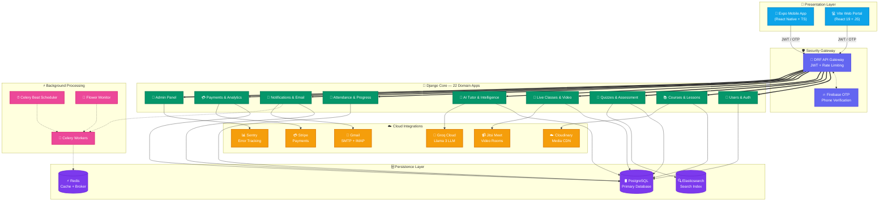

<!-- ═══════════════════════════════════════════════════════════════════════════ -->
<!-- 🎓 MENTIQ — THE ULTIMATE AI-POWERED E-LEARNING ECOSYSTEM README         -->
<!-- ═══════════════════════════════════════════════════════════════════════════ -->

<!-- ✦ ANIMATED WAVE BANNER ✦ -->


<!-- ✦ ANIMATED LOGO & TYPING SVG ✦ -->
<p align="center">
  
</p>

<p align="center">
  <a href="#">
    
  </a>
</p>

<p align="center">
  <i>Bridging the digital divide in modern education — powered by AI, driven by innovation.</i>
</p>


<!-- ✦ CORE TECH BADGES ✦ -->
<p align="center">
  
  
  
  
  
  
  
</p>

<p align="center">
  
  
  
  
  
  
  
</p>

<p align="center">
  
  
  
  
  
  
</p>

<!-- ✦ STATUS BADGES ✦ -->
<p align="center">
  
  
  
  
  
  
  
</p>


##  &nbsp; Table of Contents

<details open>
<summary>🗂️ <b>Quick Navigation</b></summary>
<br/>

| # | Section | Description |
|:---:|:---|:---|
| 01 | [🌟 Vision & Overview](#-vision--overview) | What is MentiQ and why it exists |
| 02 | [🚀 Epic Feature Matrix](#-epic-feature-matrix) | All modules and capabilities |
| 03 | [📱 Screen Inventory](#-screen-inventory--3-platforms) | Every screen across 3 platforms |
| 04 | [🏗️ Architecture Topology](#%EF%B8%8F-technical-architecture-topology) | System design and data flow |
| 05 | [📡 API Command Center](#-api-command-center--20-route-groups) | All 20 active API route groups |
| 06 | [📂 Codebase Anatomy](#-codebase-anatomy) | Folder structure breakdown |
| 07 | [🔮 Environment Config](#-environment--secrets-config) | Environment variables guide |
| 08 | [⚡ Launch Sequence](#-launch-sequence) | Step-by-step deployment |
| 09 | [🎯 QA Runbook](#-verification--qa-runbook) | Testing and verification |
| 10 | [🗺️ Roadmap](#%EF%B8%8F-evolutionary-roadmap) | Milestones and progress |
| 11 | [📜 License](#-license) | MIT License |

</details>

##  &nbsp; Vision & Overview


**MentiQ** is a groundbreaking, full-stack e-learning ecosystem that transcends traditional LMS platforms. Built with a **Tri-Platform Architecture** — native mobile (iOS + Android via Expo), modern web (Vite + React 19), and an enterprise-grade Django backend — MentiQ delivers a seamlessly synchronized experience powered by **Generative AI**.

### 💡 Why MentiQ?

- 🤖 **AI-First Design** — Groq-powered Llama 3 provides real-time tutoring, flashcard generation, and adaptive study plans.
- 🧠 **Cognitive Companion** — Real-time engagement and emotion tracking to personalize learning velocity.
- 🔐 **Zero-Friction Auth** — Firebase OTP + JWT + Multi-ID login (Email / Student ID / Teacher ID).
- 📹 **Production-Grade Video** — Jitsi Meet integration for unlimited live sessions.
- ⚡ **Real-Time Sync** — Attendance, notifications, and progress update instantly across devices.
- 📊 **Enterprise Analytics** — Celery-powered background analytics with Elasticsearch indexing.

> *"To democratize intelligence-driven education by making classroom management effortless, learning deeply personalized, and assessments unequivocally fair."*

<br clear="right"/>

##  &nbsp; Epic Feature Matrix

<br/>

<details open>
<summary>
  
</summary>
<br/>

| Feature | Description | Tech |
|:---|:---|:---|
| 💬 **Real-Time AI Tutor** | Context-aware conversational assistant with markdown rendering | `Groq API` · `Llama 3` |
| 🧠 **Cognitive Tracking** | Detects engagement trends and emotional states via interaction patterns | `useInteractionTracker` · `CognitiveAPI` |
| 🃏 **Smart Flashcards** | Auto-generates spaced-repetition decks from lesson content | `NLP` · `Semantic Extraction` |
| 📅 **Premium Study Planner** | Generates weekly schedules with DataList subject picker → exports as styled PDFs | `expo-print` · `Custom Engine` |
| 📊 **Knowledge Graph** | Tracks `quiz_accuracy`, `time_spent`, `flashcard_performance` per course | `Recharts` · `D3` |

</details>

<details>
<summary>
  
</summary>
<br/>

| Feature | Description | Tech |
|:---|:---|:---|
| 🔗 **Parent Handshake** | Secure linking system for parents to monitor student progress | `ParentAccount` · `Invitation System` |
| 📊 **Student Reports** | Real-time dashboards showing course completion, quiz scores, and attendance | `ParentDashboard.jsx` · `ParentAPI` |
| 📈 **Engagement Graph** | Visual trend analysis of student learning activity | `KnowledgeGraphCard` · `Recharts` |
| 🔔 **Alert System** | Automated notifications for low scores or missed classes | `django-signals` · `FCM` |

</details>

<details>
<summary>
  
</summary>
<br/>

| Feature | Description | Tech |
|:---|:---|:---|
| 📱 **Firebase OTP** | Passwordless phone verification via Firebase Phone Auth SDK | `firebase-admin` · `expo-firebase` |
| 🔑 **Multi-Mode Login** | Authenticate via Email, Student ID, or Teacher ID seamlessly | `Custom Backend Logic` |
| 🛡️ **JWT Rotation** | Stateless sessions with SimpleJWT, auto-refresh, and token blacklisting | `djangorestframework-simplejwt` |
| 🔒 **Biometric Lock** | Local authentication via fingerprint / face ID on mobile | `expo-local-authentication` |
| ⚙️ **Rate Limiting** | Brute-force protection on sensitive endpoints | `django-ratelimit` |

</details>

<details>
<summary>
  
</summary>
<br/>

| Feature | Description | Tech |
|:---|:---|:---|
| 💎 **Premium Badges** | Glassmorphism UI achievements with rarity tiers (Common to Mythic) | `BadgeCard` · `BadgeGallery` |
| 🏆 **3D Leaderboard** | Cinematic podiums and real-time global rankings | `LeaderboardPage` · `CinematicPodium` |
| 📝 **Smart Quizzes** | MCQ, True/False, Multi-Select with server-enforced **3-attempt daily limit** | `QuizScreen` · `Backend Validation` |
| 📈 **Platform Analytics** | Celery-generated daily snapshots of engagement and revenue | `django-celery-beat` · `Elasticsearch` |

</details>

<details>
<summary>
  
</summary>
<br/>

| Feature | Description | Tech |
|:---|:---|:---|
| 📊 **Admin Dashboard** | Real-time platform metrics with interactive visualizations | `AdminDashboard.jsx` · `recharts` |
| 👥 **Unified User Control** | CRUD for students/teachers with detailed profile deep-dives | `AdminUserDetail.jsx` |
| 📍 **Global Attendance** | Master views of attendance across all courses and sessions | `AdminAttendance.jsx` |
| 📣 **Broadcaster** | Create and manage platform-wide announcements and cohorts | `AdminAnnouncements.jsx` |
| 💎 **Plan Manager** | Tier management with custom pricing and revenue tracking | `AdminPremium.jsx` |

</details>


##  &nbsp; Screen Inventory — 3 Platforms

<br/>

<table>
<tr>
<th align="left" width="34%">📱 Mobile App (Expo)<br/><sub>33+ Native Screens</sub></th>
<th align="left" width="33%">📱 Shared & Auth Screens<br/><sub>12 Universal + 3 Auth + 18 Components</sub></th>
<th align="left" width="33%">💻 Web Dashboard (Vite)<br/><sub>51+ Components + Admin Suite</sub></th>
</tr>
<tr>
<td valign="top">

**🎓 Student Screens**

- `StudentHomeScreen` — Dashboard hub
- `BrowseCoursesScreen` — Catalog
- `StudentProgressScreen` — Tracker
- `MyBadgesScreen` — Achievements
- `LeaderboardScreen` — Rankings
- `DownloadsScreen` — Offline
- `StudentLiveClassRoomScreen`
- `AI Center (Index)` — AI hub

**👨‍🏫 Teacher Screens**

- `TeacherHomeScreen` — Teaching hub
- `MyCoursesScreen` — Manager
- `CreateCourseScreen` — Builder
- `CreateLessonScreen` · `CreateQuiz`
- `StudentDetailScreen` — Profiles
- `TeacherProgressScreen` — Analytics
- `ManageLessons` · `ManageQuizzes`

</td>
<td valign="top">

**🔗 Universal Screens**

- `ProfileScreen` — Rich profile
- `SecurityScreen` — Password & OTP
- `CourseDetailScreen` — Deep-dive
- `CourseLessonsScreen` — Browser
- `QuizScreen` · `QuizResultScreen`
- `Announcements` · `ContactUs`

**🔐 Auth & Identity**

- `LoginScreen` — Multi-mode
- `SignupScreen` — Registration
- `OnboardingScreen` — First-time
- `ParentLinkScreen` — Association

**🧩 Components (22)**

- `BadgeCard` · `BadgeGallery`
- `QbitChatWindow` · `UsageTracker`
- `OfflineDownloadButton`

</td>
<td valign="top">

**📊 Dashboard & Learning**

- `StudentDashboard` · `TeacherDashboard`
- `ParentDashboard` — Real-time monitor
- `BadgeGallery` — Achievement hub
- `LeaderboardPage` — 3D Rankings
- `ClassroomPage` — Virtual room
- `CurriculumManagementPage`
- `CourseCatalogPage` · `CourseDetail`
- `LessonViewPage` · `QuizTaking`
- `DoubtsPage` · `ContactUsPage`

**👑 Admin Suite (18 Files)**

- `AdminDashboard` · `AdminProfile`
- `AdminStudents` · `AdminTeachers`
- `AdminCourses` · `AdminEnrollments`
- `AdminAnnouncements` · `AdminPremium`
- `AdminAttendance` · `AdminParents`
- `AdminUserDetail` · `AdminUsers`

**🧩 Components (51+ JSX)**

- `GreetingCard` · `ProgressCard`
- `AIAssistantCard` · `KnowledgeGraph`
- `CalendarCard` · `AttendanceCard`
- `AnnouncementPopup` · `SuccessModal`

</td>
</tr>
</table>


##  &nbsp; Technical Architecture Topology

<p align="center">
  
</p>


```mermaid
graph TD
    classDef client fill:#0EA5E9,stroke:#0284C7,stroke-width:2px,color:#fff
    classDef gateway fill:#6366F1,stroke:#4F46E5,stroke-width:2px,color:#fff
    classDef core fill:#059669,stroke:#047857,stroke-width:2px,color:#fff
    classDef data fill:#7C3AED,stroke:#6D28D9,stroke-width:2px,color:#fff
    classDef cloud fill:#F59E0B,stroke:#D97706,stroke-width:2px,color:#fff
    classDef async fill:#EC4899,stroke:#DB2777,stroke-width:2px,color:#fff

    subgraph CLIENTS["📱 Presentation Layer"]
        M["📱 Expo Mobile App<br/>(React Native + TS)"]:::client
        W["💻 Vite Web Portal<br/>(React 19 + JS)"]:::client
    end

    subgraph AUTH["🛡️ Security Gateway"]
        API["🔀 DRF API Gateway<br/>JWT + Rate Limiting"]:::gateway
        FB["🔥 Firebase OTP<br/>Phone Verification"]:::gateway
    end

    subgraph CORE["🧠 Django Core — 22 Domain Apps"]
        U["👤 Users & Auth"]:::core
        C["📚 Courses & Lessons"]:::core
        Q["📝 Quizzes & Assessment"]:::core
        L["🎥 Live Classes & Video"]:::core
        AI["🤖 AI Tutor & Intelligence"]:::core
        A["📍 Attendance & Progress"]:::core
        N["🔔 Notifications & Email"]:::core
        P["💳 Payments & Analytics"]:::core
        AD["👑 Admin Panel"]:::core
    end

    subgraph ASYNC["⚡ Background Processing"]
        CW["🔄 Celery Workers"]:::async
        CB["⏰ Celery Beat Scheduler"]:::async
        FL["🌸 Flower Monitor"]:::async
    end

    subgraph DATA["🗄️ Persistence Layer"]
        PG[("🛢️ PostgreSQL<br/>Primary Database")]:::data
        RD[("⚡ Redis<br/>Cache + Broker")]:::data
        ES[("🔍 Elasticsearch<br/>Search Index")]:::data
    end

    subgraph CLOUD["☁️ Cloud Integrations"]
        GR["🤖 Groq Cloud<br/>Llama 3 LLM"]:::cloud
        JT["📹 Jitsi Meet<br/>Video Rooms"]:::cloud
        CL["☁️ Cloudinary<br/>Media CDN"]:::cloud
        ST["💳 Stripe<br/>Payments"]:::cloud
        GM["📧 Gmail<br/>SMTP + IMAP"]:::cloud
        SN["📊 Sentry<br/>Error Tracking"]:::cloud
    end

    M -->|"JWT / OTP"| API
    W -->|"JWT / OTP"| API
    API <-.-> FB

    API ==> U & C & Q & L & AI & A & N & P & AD

    U & C & Q & L & AI & A & N & P --> PG
    CW -.-> RD
    CB -.-> CW
    FL -.-> CW
    N -.-> CW

    AI --> GR
    L --> JT
    C --> CL
    P --> ST
    N --> GM
    AD --> SN

    Q --> ES
```


##  &nbsp; API Command Center — 20 Route Groups

<br/>

| # | Endpoint Prefix | Module | Key Operations |
|:---:|:---|:---|:---|
| 01 | `/api/v1/auth/` | 🔐 Authentication | Register, Login, JWT Refresh, Logout, Profile |
| 02 | `/api/v1/students/` | 🎓 Students | Profile CRUD, Dashboard Data, Enrollment Stats |
| 03 | `/api/v1/teachers/` | 👨‍🏫 Teachers | Profile CRUD, Course Stats, Management |
| 04 | `/api/v1/courses/` | 📚 Courses | Full CRUD, Search, Filter, Enrollment Triggers |
| 05 | `/api/v1/lessons/` | 📖 Lessons | Create, Order, Media Upload, Content Management |
| 06 | `/api/v1/quizzes/` | 📝 Quizzes | CRUD, Submit & Grade, Attempt History |
| 07 | `/api/v1/enrollments/` | 🎫 Enrollments | Enroll, Unenroll, Active Tracking, Stats |
| 08 | `/api/v1/progress/` | 📊 Progress | Completion, Milestones, Badges, Leaderboards |
| 09 | `/api/v1/live-classes/` | 🎥 Live Classes | Create Room, Join, Schedule, Chat |
| 10 | `/api/v1/announcements/` | 📢 Announcements | Broadcast, Target, Archive, Analytics |
| 11 | `/api/v1/notifications/` | 🔔 Notifications | Push, In-App, Settings, Batch Operations |
| 12 | `/api/v1/payments/` | 💳 Payments | Stripe Checkout, Webhooks, Revenue Tracking |
| 13 | `/api/v1/analytics/` | 📈 Analytics | Daily Snapshots, Course Insights, User Metrics |
| 14 | `/api/v1/ai/` | 🤖 AI Tutor | Chat, Flashcards, Interaction Tracking, Cognitive State |
| 15 | `/api/v1/emails/` | 📧 Emails | Campaigns, IMAP Sync, Contact Form, Logs |
| 16 | `/api/v1/attendance/` | 📍 Attendance | Mark, History, Reports, Session Tracking |
| 17 | `/api/v1/admin/` | 👑 Admin Panel | Platform Management, User Control, Analytics |
| 18 | `/api/v1/offline/` | 📶 Offline | Micro-lessons, Download Management, Sync |
| 19 | `/api/v1/parents/` | 👥 Parents | Linking, Student Reports, Progress Monitoring |
| 20 | `/api/v1/intelligence/` | 🧠 Intelligence | Advanced AI logic and content indexing |
| — | `/api/health/` | ❤️ Health Check | System status verification |
| — | `/api/docs/` | 📜 Swagger UI | Auto-generated API documentation |


##  &nbsp; Codebase Anatomy

```
📦 MentiQ Capstone Project
│
├── 🐍 backend/                              # Django 5.x REST API Server
│   ├── config/                              # Core Configuration
│   │   ├── settings.py                      # 12KB master settings
│   │   ├── urls.py                          # 20 active API route groups
│   │   ├── celery.py                        # Async task orchestration
│   │   └── firebase-credentials.json        # Firebase SDK keys
│   │
│   ├── apps/                                # 🧩 22 Domain Microservices
│   │   ├── users/           (8 files)       # 🔐 Auth, JWT, Registration
│   │   ├── students/        (7 files)       # 🎓 Student profiles & data
│   │   ├── teachers/        (7 files)       # 👨‍🏫 Teacher profiles & data
│   │   ├── parents/         (9 files)       # 👥 Parental monitoring & linking
│   │   ├── courses/         (7 files)       # 📚 Course CRUD & catalog
│   │   ├── lessons/         (7 files)       # 📖 Lesson management
│   │   ├── quizzes/         (7 files)       # 📝 Quiz engine & grading
│   │   ├── progress/        (9 files)       # 📊 Progress & Badge system
│   │   ├── live_classes/    (8 files)       # 🎥 Jitsi room management
│   │   ├── ai_tutor/        (10 files)      # 🤖 AI Chat & Interaction Tracking
│   │   ├── offline/         (9 files)       # 📶 Micro-lessons & sync
│   │   ├── media/           (7 files)       # 🖼️ Media processing & Cloudinary
│   │   ├── admin_panel/     (7 files)       # 👑 Admin endpoints
│   │   └── core/            (8 files)       # ⚙️ Shared utils & health
│   │
│   ├── seed_all.py                          # 🚀 Master data seeder
│   ├── requirements.txt                     # 100+ lines / 45+ packages
│   └── manage.py                            # Django CLI gateway
│
├── 📱 frontend/                             # React Native Expo (v54)
│   ├── app/                                 # 📲 Navigation & Screens
│   ├── components/          (22 files)      # 🧩 Reusable UI Components
│   ├── store/               (13 stores)     # 🏪 Zustand Global State
│   │   ├── authStore · cognitiveStore       # Identity & AI State
│   │   ├── badgeStore · parentStore         # Achievements & Linking
│   │   └── quizStore · offlineStore         # Learning & Sync
│   │
│   ├── services/            (8 services)    # 🔌 External Integrations
│   │   ├── api.ts · ai.service.ts           # REST Clients
│   │   ├── notificationService.ts           # FCM Handlers
│   │   └── offline.service.ts               # Download Engine
│   │
│   └── package.json                         # 55+ dependencies
│
├── 💻 frontendweb/                          # Vite + React 19 Web Portal
│   ├── src/
│   │   ├── components/      (72 files total)# 🧩 51 JSX + 21 CSS components
│   │   │   ├── Dashboard Cards (8)          # 📊 Greeting · Progress · Stats
│   │   │   ├── AIAssistantCard              # 🤖 QBit Web Companion
│   │   │   └── BadgeGallery · Leaderboard   # 🏆 Gamification suite
│   │   ├── admin/           (18 files total)# 👑 11 JSX + 7 CSS Admin suite
│   │   ├── hooks/                           # ⚓ useInteractionTracker
│   │   ├── App.jsx          (20KB)          # 🚀 App shell & routing
│   │   └── api.js                           # 🌐 Axios Client (Badge/Parent/AI)
│   │
│   └── package.json                         # React 19 + Vite 8 Beta
│
├── 📜 LICENSE                               # MIT License
└── 📘 README.md                             # This documentation
```


##  &nbsp; Environment & Secrets Config

<br/>

| Domain | Keys Required | Responsibility |
|:---|:---|:---|
| 🔐 **Core Identity** | `SECRET_KEY` · `DEBUG` · `ALLOWED_HOSTS` | Cryptographic signing, security modes |
| 🌐 **Frontend API** | `VITE_API_URL` | Base URL for web portal API communication |
| 🛢️ **Database** | `DATABASE_URL` | PostgreSQL connection string |
| ⚡ **Cache Layer** | `CELERY_BROKER_URL` · `REDIS_URL` | Redis-backed task queue |
| 🧠 **AI Engine** | `GROQ_API_KEY` | Llama 3 LLM authentication |
| 📧 **Mail System** | `EMAIL_HOST_USER` · `IMAP_USER` | SMTP outbound + IMAP inbound |
| 🔥 **Firebase** | `firebase-credentials.json` | OTP auth + FCM notifications |
| ☁️ **Media CDN** | `CLOUDINARY_API_KEY` · `CLOUDINARY_URL` | Media upload & transformation |


##  &nbsp; Launch Sequence

<br/>

<details open>
<summary>
  
</summary>
<br/>

```bash
# 🐍 Enter the backend realm
cd backend

# 🏗️ Setup environment
python -m venv .venv
source .venv/bin/activate          # Windows: .venv\Scripts\activate
pip install -r requirements.txt

# 🔄 Configure & Migrate
cp .env.example .env               # Edit with your credentials
python manage.py migrate

# 🚀 Seed Initial Data (Optional)
python seed_all.py                 # Injects admin, teacher, and student accounts

# 🚀 Launch server
python manage.py runserver 8000
```

</details>

<details open>
<summary>
  
</summary>
<br/>

```bash
cd frontendweb
npm install
npm run dev
# 🌐 → Dashboard available at http://localhost:5173
```

</details>

<details open>
<summary>
  
</summary>
<br/>

```bash
cd frontend
npm install
npx expo start
# 📱 → Scan the QR code with Expo Go app
```

</details>


##  &nbsp; Verification & QA Runbook

<br/>

### 🔑 Pre-Configured Live Demo Accounts
Ready-to-use accounts for immediate platform testing. All accounts use password `password123`.

| Role | Email Identity | Access Level |
| :--- | :--- | :--- |
| 👑 **Global Admin** | `admin@mentiq.com` | Full Control, Admin Suite |
| 👨‍🏫 **Instructor** | `teacher@mentiq.com` | Course Authoring, Attendance |
| 🎓 **Student** | `student@mentiq.com` | Dashboard, AI Tutor, Badges |
| 👥 **Parent** | `parent@mentiq.com` | Child Monitoring, Reports |

<br/>

> Execute these checks to certify your instance:

- [ ] **❤️ Health Pulse** — Verify `GET /api/health/` returns `{"status": "healthy"}`.
- [ ] **🧠 Cognitive Sync** — Interact with the web dashboard and verify `POST ai/interactions/` tracking.
- [ ] **📍 Attendance Sync** — Mark attendance on web → Check student mobile dashboard instantly.
- [ ] **🤖 AI Response** — Send `POST /api/v1/ai/ask/` and verify Groq Llama 3 response.
- [ ] **🎮 Badge Award** — Complete quiz/course and verify badge appears in `BadgeGallery`.
- [ ] **👥 Parent Link** — Link a parent account and verify student progress visibility.
- [ ] **📶 Offline Sync** — Download micro-lesson → Verify offline accessibility.


##  &nbsp; Evolutionary Roadmap

<p align="center">
  
</p>

| Era | Status | Monumental Deliverables |
|:---|:---:|:---|
| **V4: Security Armor** | ✅ | Firebase OTP, 3-Attempt Limits, Biometrics |
| **V5: Automation Wave** | ✅ | Parent Hub, Offline Sync, 3D Leaderboards, Admin Suite |
| **V6: Cognitive Era** | 🟡 | Interaction Tracking, Emotion Analysis, Adaptive Velocity |


## 📜 License
This project is officially licensed under the **[MIT License](LICENSE)**.

<div align="center">
  
  <br/><br/>
  <b>The MentiQ Advanced Systems Team</b>
  <br/>
  <i>Code written with undeniable passion and purpose.</i>
</div>

<br/>

<p align="center">
  
</p>


