# 🎓 MentiQ: AI-Enabled E-Learning Ecosystem

<div align="center">
  
  <br/>
  
  <p><i>Empowering students and teachers with AI-driven insights, live classrooms, and automated workflows.</i></p>
</div>

<div align="center">
  
  
  
  
  
  
  
</div>

<br/>

<div align="center">
  
  
  
</div>

---

## 📖 Project Overview

**MentiQ** is a state-of-the-art e-learning platform that harmonizes traditional educational workflows with cutting-edge **Generative AI**. By providing a unified experience across **iOS/Android**, **Web**, and a robust **RESTful Backend**, MentiQ eliminates technical friction for both educators and learners.

### 🌟 Vision
>
> *"To democratize intelligence-driven education by making classroom management effortless and learning deeply personalized."*

---

## 🚀 Key Modules & Perfect Detail

<details open>
<summary><b>🤖 AI Intelligence Center (QBit)</b></summary>
<br/>

* **⚡ Conversational Tutor**: Real-time context-aware chat utilizing Groq-powered Llama 3 models.
* **📚 Smart Flashcards**: Converts lesson content into interactive card decks with spaced-repetition logic.
* **📅 Adaptive Study Planner**: Dynamic generation of weekly schedules exported as premium-styled PDFs.
* **📊 Multi-Dimensional Knowledge Graph**:
  * *Nodes*: Enrolled courses representing mastery levels.
  * *Edges*: Prerequisite paths and progress signals.
  * *Signals*: Weights based on `quiz_accuracy`, `time_spent`, `doubts_asked`, and `flashcard_performance`.

</details>

<details>
<summary><b>🎥 Virtual Classroom & Live Sync</b></summary>
<br/>

* **🎬 Pro-Grade Video**: Seamless Jitsi Meet integration for 1:1 sessions and group classes.
* **💬 Real-Time Interaction**: Integrated chat system with participation tracking.
* **📍 Precision Attendance**:
  * *Teacher Side*: One-tap session creation and student marking.
  * *Student Side*: Live dashboard updates and historical attendance logs.
* **📅 Intelligent Booking**: Role-aware calendar for scheduling mentorship sessions.

</details>

<details>
<summary><b>📧 Enterprise Communication Engine</b></summary>
<br/>

* **📩 Advanced Emailing**:
  * *Outbound*: Automated welcome, enrollment, and progress update emails.
  * *Campaigns*: Admin-led promotional and informational bulk emailing.
  * *Inbound*: Integrated IMAP reader to sync platform inquiries directly to the dashboard.
* **🔔 Intelligent Notifications**: Trigger-based alerts for quiz results, new announcements, and class reminders.

</details>

<details>
<summary><b>� Assessment & Analytics</b></summary>
<br/>

* **🧠 Comprehensive Quizzes**: Support for MCQs, True/False, and time-boxed challenges.
* **📈 Growth Analytics**:
  * *Daily Snapshots*: Automatic Celery tasks generating platform-wide health reports.
  * *Course Insights*: Detailed breakdown of student engagement, average scores, and revenue.
* **🎖️ Gamified Progress**: Visual circle-based tracking for lesson completion and course milestones.

</details>

---

## 🏗️ Technical Architecture

```mermaid
graph LR
    subgraph "Clients Layer"
        Mobile(📱 Expo Mobile App)
        Web(💻 Vite Web Portal)
    end

    subgraph "Backend Core (Django)"
        API[DRF Gateway]
        Apps[19 Local Domain Apps]
        Tasks[Celery Async Workers]
    end

    subgraph "Data & Cache"
        DB[(🛢️ PostgreSQL)]
        Redis[(⚡ Redis Broker)]
    end

    subgraph "Third-Party Cloud"
        Groq[🤖 Groq AI]
        Media[☁️ Cloudinary]
        Stripe[💳 Stripe]
        Jitsi[📹 Jitsi Meet]
        Mail[📧 Gmail/EmailJS]
    end

    Mobile --> API
    Web --> API
    API --> Apps
    Apps --> DB
    Apps --> Redis
    Tasks --> Redis
    Apps --> Groq
    Apps --> Media
    Apps --> Stripe
    Apps --> Jitsi
    Apps --> Mail
```

<div align="center">
  
</div>



---

## 📂 Granular Folder Structure

```text
Capstone Project/
├── backend/                     # 🐍 Django 5.x REST API
│   ├── config/                  # Core settings, Celery, and ASGI/WSGI
│   ├── apps/                    # � Core Domain Logic (19 Apps)
│   │   ├── ai_tutor/            # QBit intelligence & flashcards
│   │   ├── emails/              # Campaign & IMAP integration
│   │   ├── attendance/          # Session-based tracking
│   │   └── live_classes/        # Jitsi coordination
│   ├── requirements.txt         # Dependencies
│   └── manage.py                # CLI Entrypoint
├── frontend/                    # 📱 React Native Expo Mobile
│   ├── app/                     # Navigation & Role-Based Routing
│   ├── store/                   # Zustand Global State
│   └── services/                # API & Integration Clients
├── frontendweb/                 # 💻 Vite React Web Dashboard
│   ├── src/components/          # UI Components & Dashboards
│   └── public/                  # Static Assets & Branding
└── README.md                    # This master documentation
```

---

## ⚙️ Environment Perfect Detail

Align your local environment with these specific variable groups:

| Variable Group | Purpose | Key Keys |
|:---|:---|:---|
| **Core** | Platform Identity | `DEBUG`, `SECRET_KEY`, `ALLOWED_HOSTS` |
| **Database** | Persistence | `DATABASE_URL` (Postgres) |
| **AI (Groq)** | Intelligence | `GROQ_API_KEY` |
| **Messaging** | Communication | `EMAIL_HOST_USER`, `IMAP_USER`, `EMAILJS_PUBLIC_KEY` |
| **Payment** | Revenue | `STRIPE_SECRET_KEY`, `STRIPE_WEBHOOK_SECRET` |
| **Background** | Scheduling | `CELERY_BROKER_URL`, `CELERY_RESULT_BACKEND` |

---

## 🛠️ Deployment & Execution

<div align="center">
  
</div>

### 📦 1. Multi-Step Backend Initialization

```bash
# Move to backend
cd backend

# Create & activate isolated environment
python -m venv .venv
source .venv/bin/activate # or .venv\Scripts\activate on Windows

# Install & Sync
pip install -r requirements.txt
python manage.py migrate
python manage.py runserver
```

### ⚡ 2. Real-Time Task Processing

```bash
# Requires Redis: docker run -p 6379:6379 redis
# In separate terminals (with venv active)
celery -A config worker -l info
celery -A config beat -l info
```

### 📱 3. Cross-Platform Mobile Launch

```bash
cd frontend
npm install
npx expo start --clear # Use --android or --ios for direct launch
```

---

## 🧪 System Verification Runbook

1. **🔍 Health Check**: Verify `GET /api/health/` returns `{"status": "healthy"}`.
2. **📜 Documentation**: Access auto-generated Swagger UI at `/api/docs/`.
3. **🤖 AI Validation**: Trigger `POST /api/v1/ai/ask/` to verify LLM connectivity.
4. **📧 Mail Audit**: check `Email Logs` in Admin panel after a new registration.
5. **📍 Presence Test**: Create a live class and mark attendance via the Teacher dashboard.

---

## 🗺️ Visual Roadmap & Milestones

<div align="center">
  
</div>

| Milestone | Status | Details |
|:---|:---:|:---|
| **V1: Core Learning** | Done | Courses, Lessons, Basic Auth |
| **V2: Real-time** | Done | Live Classes, Jitsi, Chat |
| **V3: AI Integration** | Done | QBit Chat, Flashcards, Plan Generator |
| **V4: Automation** | Active | Campaign Emails, Auto-Attendance, Analytics |
| **V5: Scaling** | Planned | Local LLM, Content Personalization |

---

## 📬 Contact & Premium Support

<div align="center">
  
  <br/>
  <b>The MentiQ Core Team</b>
  <br/>
  <a href="mailto:mentiq.learn@gmail.com">Contact via Email</a> | <a href="http://mentiq.com">Official Website</a>
  <br/>
  <i>Bridging the digital divide in modern education.</i>
  <br/>
  📍 Punjab, India
</div>

---
<div align="center">
  
</div>
