<!-- Banner Section -->
<p align="center">
  
</p>

<h1 align="center">🎓 MentiQ: The Next-Gen AI-Driven Learning Ecosystem</h1>

<p align="center">
  <a href="https://readme-typing-svg.herokuapp.com/">
    
  </a>
</p>

<p align="center">
  <i>Bridging the digital divide in modern education with an intelligent, seamless, and real-time environment.</i>
</p>

---

<!-- Badges Section -->
<p align="center">
  <!-- Core Tech -->
  
  
  
  
  <!-- Data & Infrastructure -->
  
  
  
  <!-- AI -->
  
  
</p>

<p align="center">
  
  
  
</p>

---

## 🌟 Vision & Overview

**MentiQ** is a groundbreaking e-learning platform architected to eliminate friction in digital education. By seamlessly fusing **traditional classroom workflows** with cutting-edge **Generative AI** and **WebRTC-powered real-time synchronization**, MentiQ offers an unparalleled experience across **iOS, Android**, and the **Web**.

> *"To democratize intelligence-driven education by making classroom management effortless, learning deeply personalized, and assessments unequivocally fair and insightful."*

---

## 🚀 Key Modules & Epic Features

<div align="center">
  <table>
    <tr>
      <td width="50%" valign="top">
        <h3>🤖 AI Intelligence Center (QBit)</h3>
        <ul>
          <li><b>Conversational Tutor</b>: Hyper-fast, context-aware student chat built on Groq's Llama 3 models.</li>
          <li><b>Smart Flashcards</b>: Automatic semantic extraction of lesson content into spaced-repetition card decks.</li>
          <li><b>Dynamic Study Planner</b>: Intelligent schedule generation mapping masteries to a <b>Premium PDF Export</b>.</li>
          <li><b>Knowledge Graph Matrix</b>: Tracking <code>quiz_accuracy</code>, <code>time_spent</code>, and <code>flashcard_performance</code> for granular personalization.</li>
        </ul>
      </td>
      <td width="50%" valign="top">
        <h3>🔐 Advanced Security & Auth</h3>
        <ul>
          <li><b>Firebase OTP</b>: Ultra-secure, passwordless mobile authentication pipeline.</li>
          <li><b>Multi-Mode Identity</b>: Revolutionary dual-login mapping (Email mapped to intrinsic Student/Teacher IDs).</li>
          <li><b>Stateless Security</b>: SimpleJWT token rotation mechanism with enforced blacklisting.</li>
          <li><b>Auto IP Config</b>: Network-aware dynamic IP bypassing for frictionless multi-device local development.</li>
        </ul>
      </td>
    </tr>
    <tr>
      <td width="50%" valign="top">
        <h3>🎥 Live Sync & Virtual Classes</h3>
        <ul>
          <li><b>Jitsi Pro-Grade Video</b>: Enterprise video integration for 1:1 mentorship and massive group lectures.</li>
          <li><b>Auto-Attendance Engine</b>: Real-time synchronization. Teachers mark presence on web, students see it instantly on mobile.</li>
          <li><b>Live Interaction</b>: Web-socket enabled chat & participation metrics.</li>
          <li><b>Smart Booking Engine</b>: Calendar-aware role scheduling ensuring no conflicts.</li>
        </ul>
      </td>
      <td width="50%" valign="top">
        <h3>💯 Assessment & Analytics</h3>
        <ul>
          <li><b>Anti-Cheat Engineering</b>: Server-enforced <b>3-attempt daily limits</b> on assessments.</li>
          <li><b>Mastery Breakdowns</b>: Micro-level performance analytics showing distinct correctness ratios per objective.</li>
          <li><b>Visual Gamification</b>: Beautiful SVG circular progress tracks, premium UI cards, and dynamic milestone markers.</li>
          <li><b>Robust Question Formats</b>: Native support for Multi-Select, Boolean, and Standard MCQs.</li>
        </ul>
      </td>
    </tr>
  </table>
</div>

### 📧 Enterprise Communication Ecosystem

MentiQ doesn't just manage classes; it drives interactions.

- **Outbound Automation**: Async Celery workers dispatching welcome protocols, enrollment updates, and triggered system alerts.
- **Cohort Marketing**: Admin panel UI for executing targeted mass-email campaigns to specific student demographics.
- **Inbound IMAP Sync**: Support desk messages are pulled directly from Google servers into the admin dashboard for seamless ticket resolution.

---

## 🏗️ Technical Architecture Topology

```mermaid
graph TD
    %% Styling
    classDef client fill:#0EA5E9,stroke:#fff,stroke-width:2px,color:#fff,rx:8px,ry:8px;
    classDef auth fill:#F39C12,stroke:#fff,stroke-width:2px,color:#fff,rx:8px,ry:8px;
    classDef core fill:#0C4B33,stroke:#fff,stroke-width:2px,color:#fff,rx:8px,ry:8px;
    classDef db fill:#316192,stroke:#fff,stroke-width:2px,color:#fff,rx:8px,ry:8px;
    classDef external fill:#2C3E50,stroke:#fff,stroke-width:2px,color:#fff,rx:8px,ry:8px;

    %% Nodes
    subgraph Clients["📱 Presentation Layer"]
        Mobile["React Native (Expo App)"]:::client
        Web["Vite + React (Dashboard)"]:::client
    end

    subgraph Gateway["🛡️ Security & Auth"]
        API["DRF API Gateway & JWT Auth"]:::auth
        Firebase["🔥 Firebase Phone OTP"]:::external
    end

    subgraph Core["🧠 Django Core Services (20+ Apps)"]
        Learning["Course & Lesson Engine"]:::core
        AI_Module["QBit AI & Planner"]:::core
        Realtime["Attendance & Live Sync"]:::core
        Comms["Emails & Notifications"]:::core
        Quiz["Assessment Engine"]:::core
        Tasks["Celery Async Workers"]:::core
    end

    subgraph Infrastructure["🗄️ Persistence & Cache"]
        DB[("PostgreSQL")]:::db
        Redis[("Redis Broker")]:::db
    end

    subgraph Ext["☁️ Cloud Integrations"]
        Groq["Groq Cloud LLM"]:::external
        Jitsi["Jitsi Meet Server"]:::external
        Stripe["Stripe Payments"]:::external
        IMAP["Gmail SMTP/IMAP"]:::external
        Cloudinary["Cloudinary CDN"]:::external
    end

    %% Connections
    Mobile --> |"JWT/OTP"| API
    Web --> |"JWT/OTP"| API
    API <--> Firebase
    
    API ==> Learning
    API ==> AI_Module
    API ==> Realtime
    API ==> Comms
    API ==> Quiz
    
    Tasks -.-> Comms
    Tasks -.-> Realtime
    
    Learning --> DB
    AI_Module --> DB
    Realtime --> DB
    Comms --> DB
    Quiz --> DB
    
    Tasks --> Redis
    Realtime --> Redis
    
    AI_Module --> Groq
    Realtime --> Jitsi
    Learning --> Stripe
    Comms --> IMAP
    Learning --> Cloudinary
```

<p align="center">
  
</p>



---

## 🔮 Perfect Detail: Secrets & Environment

Ensure unparalleled security and system alignment by strictly maintaining these environment domains within your `.env` arrays.

| Domain | Keys Required | System Responsibility |
|:---|:---|:---|
| 🔐 **Core Identity**   | `SECRET_KEY`, `DEBUG`, `ALLOWED_HOSTS` | Manages cryptographic signing, error handling, and gateway whitelists. |
| 🛢️ **Persistence**     | `DATABASE_URL` | Connects Django ORM directly to your PostgreSQL clusters. |
| 🧠 **Intelligence**    | `GROQ_API_KEY` | Authenticates Llama 3 calls for the QBit Tutor and automated plan generation. |
| 📡 **Communications**  | `EMAIL_HOST_USER`, `IMAP_USER`, `EMAILJS_PUBLIC_KEY` | Powers the massive Celery worker ecosystem for inbound/outbound sync. |
| 💳 **Revenue Engine**  | `STRIPE_SECRET_KEY`, `STRIPE_WEBHOOK_SECRET` | Facilitates secure course enchantments and subscription tracking. |
| 🔥 **Authentication**  | `google-services.json` | Must be injected into the Expo build pipeline for Firebase Phone verification. |
| ⚡ **Messaging Bus**   | `CELERY_BROKER_URL`, `CELERY_RESULT_BACKEND` | Dictates worker queues and heartbeat protocols for async task management. |

---

## ⚡ Deployment & Execution Matrix

Achieve full-stack liftoff using these precision commands.

<details open>
<summary><b>1️⃣ Core Backend Initialization</b></summary>
<br/>

```bash
# 1. Enter the highly decoupled backend realm
cd backend

# 2. Architect an isolated Python ecosystem
python -m venv .venv

# 3. Activate the neural pathways
source .venv/bin/activate  # Windows: .venv\Scripts\activate

# 4. Integrate system dependencies
pip install -r requirements.txt

# 5. Evolve database schemas
python manage.py migrate

# 6. Ignite the server (Binding to 0.0.0.0 auto-resolves for the dynamic IP network fetcher)
python manage.py runserver 0.0.0.0:8000
```

</details>

<details open>
<summary><b>2️⃣ Background Workers (Celery & Redis)</b></summary>
<br/>

```bash
# Ensure a Redis instance is pulsing:
# docker run -d -p 6379:6379 redis

# Terminal A: Launch the execution workers
celery -A config worker -l info

# Terminal B: Launch the chronological chronometer (Beat)
celery -A config beat -l info
```

</details>

<details open>
<summary><b>3️⃣ Client Interfaces (Web & Native)</b></summary>
<br/>

**The Web Dashboard:**

```bash
cd frontendweb
npm install
npm run dev
# The sleek admin and teacher console awaits at http://localhost:5173
```

**The Mobile Client:**

```bash
cd frontend
npm install
npx expo start --clear
# Scan the holographic QR with Expo Go to experience the native app.
```

</details>

---

## 🎯 Verification & QA Runbook

Run these exact matrices to certify your local instance is Enterprise-Ready:

- [ ] **Dual-Auth Velocity Check**: Attempt an authentication using an Email, then try signing in using an intrinsic `Student ID`. Both must resolve immediately to a valid JWT.
- [ ] **Data Integrity (Quiz)**: Take a quiz 4 times. The system **must** block the 4th attempt natively and showcase your micro-level correct/incorrect ratios perfectly.
- [ ] **Live Pulse Sync**: Using two browsers, have a Teacher modify attendance. The Student dashboard must mutate instantly without a manual browser refresh.
- [ ] **Generation Integrity**: Navigate to the Study Planner, fetch subjects using the newly styled DataList, and ensure the resulting Premium PDF exports flawlessly with correct headers.
- [ ] **Inbox Intercept**: Fire a test email to your support address and execute the IMAP sync task. Ensure it materializes identically within the Django Admin console.

---

## 🗺️ Project Atlas & Evolutionary Milestones

<p align="center">
  
</p>

| Era | Status | Monumental Deliverables |
|:---|:---:|:---|
| **V1: Core Foundations** | ✅ **Forged** | Courses, Interactive Lessons, Multi-Role Unified Auth. |
| **V2: Real-time Epoch** | ✅ **Forged** | Live Classes, Jitsi Video Grid, Auto-Attendance Synchronization. |
| **V3: Artificial Mind** | ✅ **Forged** | QBit Real-Time Chat, Spaced Flashcards, Premium Plan Generator. |
| **V4: Logic & Defense** | ✅ **Forged** | Firebase OTP Passports, 3-Attempt Restrictions, Dynamic IP Tracking. |
| **V5: Automation Wave**| 🟡 **Polishing**| Campaign Mails, IMAP Bidirectional Sync, Premium UI Card Implementations. |
| **V6: Global Scale** | ⚪ **Future**| Multi-Lingual Contextual AI, Advanced ML Retention Predictors. |

---

## 🎩 Meet the Architects

This masterwork was constructed to redefine education. If you are captivated by our framework, connect with us.

<div align="center">
  
  
  
  <br/><br/>
  <b>The MentiQ Advanced Systems Team</b><br/>
  <i>mentiq.learn@gmail.com | http://mentiq.com</i><br/><br/>
  <p><i>Code written with undeniable perfection and purpose.</i></p>
</div>

<p align="center">
  
</p>
